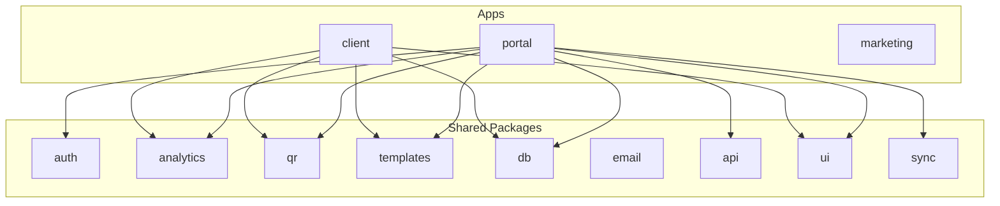

# ZironTap — Production-Ready Files and Folder Structure

## 1. Root Layout

```
zirontap/
├── apps/
│   ├── marketing/          # Landing and product info
│   ├── client/             # Public-facing (cards, redirects, review pages)
│   └── portal/             # Admin app (manage cards, links, QR, reviews)
├── packages/
│   ├── auth/               # Better Auth — orgs, Google, Apple, passkeys
│   ├── analytics/          # Clicks, views, events; Umami/custom integration
│   ├── qr/                 # Multi-type QR (url, vCard, WiFi, etc.) + rendering
│   ├── templates/          # Theme/template logic; review-card templates
│   ├── media/              # Image processing: WebP, thumbnails (person, cover, attachments, logos)
│   ├── db/                 # Drizzle schema, migrations, Studio
│   ├── email/              # Email — nodemailer + react-email; verification, reset, invites
│   ├── api/                # oRPC routers (shared procedures)
│   ├── ui/                 # shadcn + Base UI + design tokens
│   ├── config/             # Shared env (t3-oss/env-nextjs)
│   ├── validators/         # Zod schemas — single source of truth for validation + types
│   ├── rate-limit/         # Rate limiting — @upstash/ratelimit or rate-limiter-flexible (free)
│   ├── jobs/               # Background jobs (Inngest today; swappable adapter)
│   └── sync/               # Offline-first: IndexedDB, pending queue, sync layer
├── tooling/
│   ├── biome/              # Shared Biome config (extends, lint, format)
│   ├── typescript-config/  # Base TS config (base.json, strict, paths)
│   ├── vitest-config/      # Shared Vitest base config
│   ├── commitlint/         # Conventional commits config
│   └── dependency-rules/   # dependency-cruiser (layer rules, no circular deps)
├── turbo/
│   └── generators/         # @turbo/gen (Plop) — turbo gen init
│       ├── templates/     # .hbs: package.json, tsconfig.json, src/index.ts
│       ├── config.ts      # plop.setGenerator("init", {...})
│       └── package.json   # @turbo/gen devDep
├── .vscode/                # Workspace settings, extensions
│   ├── settings.json       # Biome default formatter, format on save, TS prefs
│   ├── extensions.json    # Biome, Tailwind, Drizzle, Playwright, GitLens
│   └── tasks.json         # Optional: build, test, db:migrate
├── .cursor/
│   └── rules/              # Cursor rules — naming, code style, commit format
│       ├── conventions.mdc # alwaysApply: naming, code style, commit format
│       ├── naming.mdc      # globs: **/*.{ts,tsx} — detailed naming
│       └── react.mdc       # globs: **/*.tsx — React patterns, component structure
├── .changeset/             # Changesets — versioning, changelogs
├── .husky/                 # Git hooks (pre-commit: lint, format, typecheck)
├── pnpm-workspace.yaml
├── turbo.json
├── package.json
├── components.json         # shadcn init --monorepo (cn util, component paths)
├── docker-compose.yml      # Local dev: Postgres, Redis/Valkey (+ optional services)
├── Dockerfile
├── TODO.md                 # Task tracker — priorities, in progress, backlog
├── .env.example
├── .nvmrc                  # Pin Node version (e.g. 22)
├── .editorconfig           # Indentation, line endings (LF) across IDEs
└── .gitattributes         # LF for text files; cross-platform consistency
```

---

## 2. Apps Breakdown

### 2.1 `apps/marketing`

- **Purpose:** Landing and product info; pricing page with Polar checkout CTA.
- **Structure:** Next.js 16 App Router, static/marketing pages.
- **Key files:**
  - `src/app/page.tsx`, `layout.tsx`
  - `src/app/(marketing)/pricing/page.tsx` — pricing tiers, CTA → sign up or `authClient.checkout({ slug: "pro" })`
  - `src/app/(marketing)/features/`, `about/`
- **Dependencies:** `@ziron/ui`, `@ziron/config`, `@ziron/auth` (sign-up CTA, Polar checkout)

### 2.2 `apps/client`

- **Purpose:** Public-facing card preview, short-link redirects, review card pages.
- **Routes:**


| Route            | Purpose                             |
| ---------------- | ----------------------------------- |
| `/[slug]`        | Digital business card public page   |
| `/r/[shortCode]` | Short-link redirect (302 to target) |
| `/review/[slug]` | Review card public page             |


- **Key files:**
  - `src/app/[slug]/page.tsx` — card render (template-driven)
  - `src/app/r/[shortCode]/page.tsx` — redirect handler + click analytics
  - `src/app/review/[slug]/page.tsx` — review template + CTA → reviewUrl
- **Dependencies:** `@ziron/db`, `@ziron/analytics`, `@ziron/qr`, `@ziron/templates`, `@ziron/ui`

### 2.3 `apps/portal` — Scalable SaaS Architecture

- **Purpose:** Admin UI for digital business cards, short links, QR codes, review cards; organization management; billing; settings; media library; analytics. Role-based access (super admin, admin, member). Organization-scoped routes with `[orgSlug]`.
- **Structure:** Next.js 16 App Router; authenticated dashboard; `[orgSlug]` layout for org-scoped routes; global routes for super admin.

#### 0. App-level providers

Central `providers/` directory at app root (e.g. `apps/portal/src/providers/`) for global context setup. Each provider is a focused wrapper; `index.ts` composes them into a single `AppProvider` or `RootProvider` used in the root layout.

**Structure:**

```
apps/portal/src/providers/
├── index.ts                    # Compose all providers; export AppProvider
├── theme-provider.tsx           # Dark/light mode — next-themes or shadcn ThemeProvider
├── nuqs-provider.tsx            # nuqs NuqsAdapter — URL search params state
├── jotai-provider.tsx           # Jotai Provider — atomic state
├── tanstack-provider.tsx        # TanStack QueryClientProvider (and Table/Form if needed)
├── page-load-progress-provider.tsx  # NProgress-style bar on route change (next-nprogress-bar)
├── keyboard-shortcut-provider.tsx    # Global keyboard shortcuts (⌘K command palette, etc.)
├── analytics-provider.tsx       # Product analytics, feature flags (PostHog, Umami, OpenPanel)
├── pdf-worker-provider.tsx      # PDF web worker — offload PDF generation (exports, QR PDF)
├── react-scan-provider.tsx     # QR/barcode scanning — camera, scan state (optional)
└── ...                         # Other integrations as needed
```

**Core providers (required):**

- **theme-provider** — Dark/light mode; next-themes or shadcn `ThemeProvider`; sync with system preference
- **nuqs-provider** — nuqs `NuqsAdapter` for URL search params (filters, pagination, modals)
- **jotai-provider** — Jotai `Provider` for client state
- **tanstack-provider** — `QueryClientProvider` for server state, caching, oRPC

**UX providers:**

- **page-load-progress-provider** — Top-of-page progress bar on route transitions (e.g. next-nprogress-bar, NProgress)
- **keyboard-shortcut-provider** — Global shortcuts: ⌘K command palette, navigation, quick actions

**Optional / swappable:**

- **analytics-provider** — Product analytics (PostHog, Umami, OpenPanel, or custom)
- **pdf-worker-provider** — Web worker for PDF rendering (card/QR exports)
- **react-scan-provider** — QR/barcode scanning (camera access, scan UI)

**Pattern:** Root layout wraps `children` with `AppProvider`; providers nest in dependency order (e.g. TanStack outermost, Jotai inside, analytics last). Keep each provider thin; avoid business logic in providers.

---

#### 1. Routing & URL Structure

**Organization-scoped routes** — `/[orgSlug]/...` (org slug from URL; layout resolves org, enforces access)


| Route                        | Purpose                                             |
| ---------------------------- | --------------------------------------------------- |
| `/`                          | Homepage — org switcher, quick actions; upgrade CTA |
| `/[orgSlug]`                 | Org dashboard — overview, quick create              |
| `/[orgSlug]/cards`           | List, search, filters, CSV import/export            |
| `/[orgSlug]/cards/create`    | Create new card                                     |
| `/[orgSlug]/cards/[id]`      | View card                                           |
| `/[orgSlug]/cards/[id]/edit` | Edit card                                           |
| `/[orgSlug]/cards/tags`      | Card tags management                                |
| `/[orgSlug]/cards/templates` | Card templates library                              |
| `/[orgSlug]/links`           | Short links — list, create                          |
| `/[orgSlug]/links/create`    | Create short link                                   |
| `/[orgSlug]/links/tags`      | Link tags                                           |
| `/[orgSlug]/links/analytics` | Per-link analytics                                  |
| `/[orgSlug]/qr`              | QR codes — list, create                             |
| `/[orgSlug]/qr/create`       | Create QR (multi-type)                              |
| `/[orgSlug]/reviews`         | Review cards — list, create                         |
| `/[orgSlug]/reviews/create`  | Create review card                                  |
| `/[orgSlug]/media`           | Media library — uploads, reuse                      |
| `/[orgSlug]/members`         | Org members — invite, roles, remove                 |
| `/[orgSlug]/billing`         | Plans, invoices, usage (admin only)                 |
| `/[orgSlug]/settings`        | Org settings — general, security, etc.              |


**Global routes** (account-level, no org context)


| Route                     | Purpose                        |
| ------------------------- | ------------------------------ |
| `/settings`               | Account — profile, preferences |
| `/settings/security`      | Password, 2FA, passkeys        |
| `/settings/notifications` | Notification preferences       |
| `/settings/api-keys`      | API keys                       |
| `/settings/integrations`  | Integrations                   |
| `/checkout/success`       | Post-payment success           |


**Super admin routes** — Only visible for super admin; no org scope


| Route                  | Purpose             |
| ---------------------- | ------------------- |
| `/admin/organizations` | All organizations   |
| `/admin/users`         | All users           |
| `/admin/logs`          | System logs         |
| `/admin/features`      | Feature flags (opt) |


---

#### 2. Organization Management

- **Top organization switcher** — Dropdown in header/sidebar; lists user's orgs; switches `orgSlug` in URL (e.g. `/[orgSlug]/cards`).
- **Multi-org membership** — Users can belong to multiple organizations. Role per org (`organization_members`).
- **Org creation limits:**
  - **Free tier:** 1 org per user (or 0 if signup requires purchase).
  - **Paid tier:** N orgs per plan (e.g. 1, 5, unlimited).
- **Extra org billing:** If user hits limit, show upgrade CTA or "Add organization" → checkout for extra org add-on (Polar product).
- **Org slug:** Unique, URL-safe; used in routes. Stored in `organizations.slug`.

---

#### 3. User Roles & Permissions


| Role            | Scope    | Permissions                                                                |
| --------------- | -------- | -------------------------------------------------------------------------- |
| **Super admin** | Platform | Full access to all orgs; `/admin/`*; manage organizations, users, logs     |
| **Admin**       | Per org  | Cards, links, QR, reviews, media, members, billing, settings for their org |
| **Member**      | Per org  | Cards, links, QR, reviews, media; no billing, no member management         |


- **Hierarchy:** Super admin > Admin > Member
- **Storage:** `organization_members(userId, organizationId, role)`; `users` table has `is_super_admin` (or separate `platform_admins`) for super admin.
- **Enforcement:** Layout/middleware resolves org from `[orgSlug]`, checks `organization_members` for current user; redirect or 403 if unauthorized.

---

#### 4. Sidebar & Navigation

**Organization-scoped sidebar** (when `[orgSlug]` is in URL)

- **Dashboard** — `/[orgSlug]`
- **Cards** — `/[orgSlug]/cards` (sub: create, tags, templates, analytics)
- **Short Links** — `/[orgSlug]/links` (sub: create, tags, analytics)
- **QR Codes** — `/[orgSlug]/qr` (sub: create, templates, analytics)
- **Review Cards** — `/[orgSlug]/reviews` (sub: create, templates, analytics)
- **Library**
  - Media — `/[orgSlug]/media`
  - Templates — `/[orgSlug]/templates` (shared: cards, QR, reviews)
  - Tags — `/[orgSlug]/tags` (shared: cards, links)
- **Analytics** — Global org-wide view
  - Overview — `/[orgSlug]/analytics` (cross-resource: cards, links, QR, reviews)
  - Events — `/[orgSlug]/analytics/events`
  - Traffic — `/[orgSlug]/analytics/traffic` (geo, device, referrer)
  - Reports — `/[orgSlug]/analytics/reports` (export, scheduled)
- **Team**
  - Members — `/[orgSlug]/members`
  - Roles — `/[orgSlug]/members/roles`
  - Invites — `/[orgSlug]/members/invites`
- **Billing** — `/[orgSlug]/billing` (admin only)
  - Plans, Invoices, Usage
- **Settings** — `/[orgSlug]/settings` (org-level)

**Account-level** (in header or secondary nav)

- Settings — `/settings` (profile, security, notifications, api-keys)

**Admin-only** (super admin)

- Organizations — `/admin/organizations`
- Users — `/admin/users`
- Logs — `/admin/logs`

---

#### 4.1 Analytics UX & Architecture

**Dual model: Global + Contextual** — Analytics where users need them, plus a unified overview.

**Global analytics** (`/[orgSlug]/analytics`)

- **Purpose:** Big-picture view across all resources. Answer: "How is my org performing overall?"
- **Content:** Aggregate views/clicks; top performers across cards, links, QR, reviews; trends; traffic (geo, device, referrer); events log; reports/export.
- **Use case:** Executives, admins checking health; weekly/monthly review; export for stakeholders.

**Contextual analytics** (embedded in each resource section)

- **Purpose:** Metrics next to the resource they describe. Answer: "How is this card/link/QR/review performing?" without leaving the section.
- **Pattern:**
  - **List view** — Inline metrics (e.g. views count, last 7d trend) in table/card list. Quick scan of performance.
  - **Detail view** — `/[orgSlug]/cards/[id]`, `/[orgSlug]/links/[id]`, etc. — Analytics tab or section: views, clicks, geo, timeline.
  - **Section analytics** — `/[orgSlug]/cards/analytics`, `/[orgSlug]/links/analytics`, `/[orgSlug]/qr/analytics`, `/[orgSlug]/reviews/analytics` — Dedicated analytics for that resource type (compare cards, top links, etc.).

**UX principles**

- **Proximity** — Show analytics near the resource. User editing a card sees that card's performance immediately.
- **Progressive disclosure** — List → inline metrics; detail → full analytics; global → cross-resource.
- **Consistency** — Same chart types (line, bar, geo map) and metric cards across cards, links, QR, reviews.
- **Actionable** — "This card has 12 views this week" with CTA: Share, Edit, Copy link.

**Routes summary**

| Scope      | Route                          | Purpose                                      |
| ---------- | ------------------------------ | -------------------------------------------- |
| Global     | `/[orgSlug]/analytics`         | Cross-resource overview                      |
| Global     | `/[orgSlug]/analytics/events`  | Raw events                                   |
| Global     | `/[orgSlug]/analytics/traffic` | Geo, device, referrer                        |
| Global     | `/[orgSlug]/analytics/reports` | Export, scheduled reports                    |
| Contextual | `/[orgSlug]/cards/analytics`   | Card-specific: compare cards, top performers |
| Contextual | `/[orgSlug]/cards/[id]`        | Single card analytics (tab or section)       |
| Contextual | `/[orgSlug]/links/analytics`   | Short-link analytics                         |
| Contextual | `/[orgSlug]/links/[id]`        | Single link analytics                        |
| Contextual | `/[orgSlug]/qr/analytics`      | QR analytics                                 |
| Contextual | `/[orgSlug]/qr/[id]`           | Single QR analytics                          |
| Contextual | `/[orgSlug]/reviews/analytics` | Review card analytics                        |
| Contextual | `/[orgSlug]/reviews/[id]`      | Single review analytics                      |


---

#### 5. Database & Multi-Org Structure

**Core tables**

| Table                  | Purpose                                                           |
| ---------------------- | ----------------------------------------------------------------- |
| `users`                | Auth users (Better Auth); optional `is_super_admin`               |
| `organizations`        | `id`, `slug` (unique), `name`, `createdAt`, `updatedAt`           |
| `organization_members` | `userId`, `organizationId`, `role` (admin                         |
| `platform_admins`      | (optional) `userId` — super admins; or use `users.is_super_admin` |


**Resource tables** (all scoped by `organizationId`)

| Table          | Key columns                                                              |
| -------------- | ------------------------------------------------------------------------ |
| `cards`        | `id`, `organizationId`, `slug`, `data`, `template`, `theme`, `createdAt` |
| `short_links`  | `id`, `organizationId`, `shortCode`, `targetUrl`, `expiresAt`            |
| `qr_records`   | `id`, `organizationId`, `type`, `payload`, `customization`               |
| `review_cards` | `id`, `organizationId`, `slug`, `reviewUrl`, `template`, `theme`, `logo` |
| `media`        | `id`, `organizationId`, `url`, `type`, `metadata` (person, cover, etc.)  |
| `tags`         | `id`, `organizationId`, `name`, `color` (used by cards, links)           |
| `templates`    | `id`, `organizationId` (nullable for global), `type`, `data`             |


**Billing & entitlements**

| Table              | Key columns                                                       |
| ------------------ | ----------------------------------------------------------------- |
| `org_entitlements` | `organizationId`, `productId`, `polarOrderId`, `purchasedAt`      |
| `org_limits`       | (optional) `organizationId`, `maxOrgs`, `maxCards`, etc. per plan |


**Analytics & activity**

| Table              | Key columns                                                                        |
| ------------------ | ---------------------------------------------------------------------------------- |
| `analytics_events` | `id`, `organizationId`, `entityType`, `entityId`, `event`, `timestamp`, `metadata` |
| `activity_log`     | `id`, `organizationId`, `userId`, `action`, `entityType`, `entityId`, `createdAt`  |


**Invitations**

| Table                  | Key columns                                                                     |
| ---------------------- | ------------------------------------------------------------------------------- |
| `organization_invites` | `id`, `organizationId`, `email`, `role`, `invitedBy`, `expiresAt`, `acceptedAt` |


**Relationships**

- `organizations` 1:N `organization_members`, `cards`, `short_links`, `qr_records`, `review_cards`, `media`, `tags`, `analytics_events`
- `organization_members` N:1 `users`, `organizations`
- `cards`, `short_links`, `review_cards` reference `media` for images

#### 5.1 Database Architecture & Scalability

**ID strategy**

- **Primary keys:** Use `uuid` (or `cuid2`) for all tables — avoids enumeration, supports distributed ID generation, safe for public URLs.
- **Public slugs:** `cards.slug`, `review_cards.slug` — unique per org: `UNIQUE(organization_id, slug)`. `short_links.short_code` — globally unique.
- **Better Auth:** `users` table may use auth provider IDs; ensure `id` is uuid/cuid for consistency.

**Index design** — Index for every query pattern; avoid full table scans.

| Table                  | Indexes                                                                | Purpose                               |
| ---------------------- | ---------------------------------------------------------------------- | ------------------------------------- |
| `organizations`        | `slug` (unique)                                                        | Org lookup by URL                     |
| `organization_members` | `(user_id, organization_id)` unique, `(organization_id, role)`         | Membership check, list members by org |
| `cards`                | `(organization_id, created_at DESC)`, `(organization_id, slug)` unique | List, pagination; slug lookup         |
| `short_links`          | `short_code` (unique), `(organization_id, created_at DESC)`            | O(1) redirect lookup; list            |
| `short_links`          | `expires_at` WHERE `expires_at IS NOT NULL`                            | Cleanup job for expired links         |
| `qr_records`           | `(organization_id, created_at DESC)`, `(entity_type, entity_id)`       | List; polymorphic entity lookup       |
| `review_cards`         | `(organization_id, created_at DESC)`, `(organization_id, slug)` unique | List; slug lookup                     |
| `analytics_events`     | `(organization_id, entity_type, entity_id, created_at DESC)`           | Per-entity analytics, time-bounded    |
| `analytics_events`     | `(organization_id, created_at DESC)`                                   | Org-wide event log, reports           |
| `activity_log`         | `(organization_id, created_at DESC)`                                   | Audit trail, activity feed            |
| `organization_invites` | `(organization_id, email)`, `(token)` unique                           | Invite lookup; token validation       |


**analytics_events — high-volume design**

- **Write path:** `trackView`/`trackClick`/`trackEvent` → insert into `analytics_events` (append-only). Batch inserts where possible (e.g. buffer 100ms).
- **Read path:** Dashboard queries should hit pre-aggregated data, not raw events at scale.
- **Pre-aggregation table:** `analytics_daily_summary` — `(organization_id, entity_type, entity_id, date, event_type, count)`. Background job (e.g. Inngest, hourly) aggregates from `analytics_events` into daily buckets. Dashboards query `analytics_daily_summary` for charts; raw `analytics_events` only for recent/export.
- **Partitioning (future):** When events exceed ~10M rows, partition `analytics_events` by `created_at` (monthly). Drizzle/Postgres: native partitioning or pg_partman.
- **Retention:** Configurable retention (e.g. 90 days raw, 2 years aggregated). Archive job moves old partitions to cold storage or deletes.

**short_links — redirect optimization**

- **Hot path:** `/r/[shortCode]` is the highest-traffic route. `short_code` unique index gives O(1) lookup.
- **Caching:** Redis cache `short_code → target_url` for top N links (e.g. LRU, 10k entries). Invalidate on update/delete. Fallback to DB on cache miss.
- **Expired links:** Index on `expires_at`; nightly job soft-deletes or marks expired; redirect returns 410 Gone.

**Constraints & data integrity**

- **FKs:** All `organization_id`, `user_id`, `entity_id` references have `ON DELETE CASCADE` or `RESTRICT` per business rule. Analytics: `RESTRICT` or keep orphaned for historical integrity.
- **Check constraints:** `organization_members.role IN ('super_admin','admin','member')`; `analytics_events.entity_type IN ('card','link','qr','review_card')`.
- **Nullable:** `templates.organization_id` nullable for global templates; `qr_records` polymorphic FKs nullable (one of `card_id`, `short_link_id`, `review_card_id`).

**Soft deletes**

- Add `deleted_at TIMESTAMPTZ` to `cards`, `short_links`, `qr_records`, `review_cards`, `media`. Default `WHERE deleted_at IS NULL` in queries. Enables audit, recovery, undo.
- Hard delete via background job after retention (e.g. 30 days).

**Connection & infrastructure**

- **Connection pooling:** PgBouncer (or Supabase/Neon built-in) — transaction pooling for serverless, session pooling for long-lived workers.
- **Read replicas (future):** Analytics/reporting queries → read replica. Writes → primary. Use `readPreference` or separate connection string.
- **Separate analytics DB (future):** At very high event volume, move `analytics_events` to TimescaleDB or ClickHouse. Sync via CDC or batch ETL.

**Caching strategy**

- **Org metadata:** Redis `org:{id}` — name, slug, limits; TTL 5m; invalidate on org update.
- **Member roles:** Redis `org:{id}:members` — role map; invalidate on invite/remove/role change.
- **Redirects:** Redis `redirect:{short_code}` — target_url; TTL 1h or no TTL with explicit invalidation.

---

#### 6. Scalability Considerations

- **Multi-org support:** All resource tables include `organizationId`; queries filter by org. Indexes per table above.
- **Role-based access:** Middleware/layout checks `organization_members.role` before rendering org-scoped routes; API procedures enforce same.
- **Billing per organization:** `org_entitlements` links purchase to org; `org_limits` (or plan config) drives feature gates (max orgs, max cards, etc.).
- **Analytics scoped per org:** `analytics_events.organizationId`; dashboards and reports filter by current org.
- **Org slug uniqueness:** Unique constraint on `organizations.slug`; handle collisions on create.
- **Caching:** Redis cache for org metadata, member roles; invalidate on org/member updates.
- **Rate limiting:** Per-org or per-user for API and background jobs.

---

- **E2E:** Playwright in `apps/portal/e2e/` for auth, org switch, card CRUD, roles
- **Dependencies:** All packages including `@ziron/sync`, `@ziron/jobs`; TanStack Table, TanStack Form, Jotai, nuqs

---

### 2.4 Performance & Optimization

**React Compiler** — Enable in Next.js 16 (`next.config.ts`). Auto-memoizes components; avoid manual `useMemo`/`useCallback` unless needed for ref stability or external APIs. Add `react-compiler` to catalog.

**Client boundary** — Use `'use client'` only where required: providers, TanStack Form/Query, image editor, PDF worker, keyboard shortcuts, nuqs. Prefer server components for layouts and static content. Lazy-load heavy features with `next/dynamic` + `ssr: false` (image editor modal, PDF export, charts, react-scan).

**Dynamic imports** — Use `next/dynamic` for: image editor (react-advanced-cropper), PDF worker/export UI, analytics charts, react-scan. Reduces initial bundle and improves TTI.

**TanStack Query defaults** — Shared QueryClient config: `staleTime` 60s for lists, 5m for org metadata; `gcTime` 10m; `retry` 1–2 for mutations, 3 for queries; `refetchOnWindowFocus: false` for dashboard views to avoid flicker.

**List virtualization** — Phone country selector already virtualized. Use `@tanstack/react-virtual` (or table virtualization) for cards/links/reviews lists when rows exceed ~50.

**Images** — Use `next/image` with `sizes` and `priority` for LCP (card cover, profile). `packages/media` outputs width/height for `next/image`. Use `loading="lazy"` and `placeholder="blur"` below the fold.

**Marketing** — Static generation or ISR; pricing page ISR with revalidate (e.g. 3600) if pricing can change.

**Client app** — `/[slug]` card pages: `generateStaticParams` for popular cards if data available; ISR with short revalidate (e.g. 60) for freshness vs performance.

**Provider tree** — Keep providers thin; scope heavy providers (e.g. PDF worker) to routes that need them when possible.

**Error boundaries** — Route-level `error.tsx` in App Router; section-level boundaries for heavy areas (analytics, image editor).

**Suspense** — `loading.tsx` per route segment; wrap heavy async sections (analytics charts, live preview sheet) in `<Suspense>` for streaming.

**Bundle analysis** — Add `@next/bundle-analyzer` script (or in CI) to track bundle size; run periodically.

**Next.js config** — In `next.config.ts` (or `next.config.js`) for each app:

- **Typed routes** — `typedRoutes: true` (Next.js 15+) for type-safe `Link` hrefs and `useRouter` params. Generates route types from the app directory structure.
- **Experimental** — Consolidate in a single `experimental` block:

```ts
  experimental: {
    typedRoutes: true,
    turbopackFileSystemCacheForDev: true,
    turbopackFileSystemCacheForBuild: true,
  },
  

```

  Turbopack filesystem caching speeds up `next dev` and `next build`.

---

## 3. Shared Packages

### 3.1 `packages/auth`

- **Role:** Better Auth — users, organizations, Email & Password, Google/Apple, passkeys, 2FA; Role-based access control, Admin management, **Polar** for payments (one-time).
- **Structure:**
  - `src/index.ts` — auth config export
  - `src/org.ts` — org plugin
  - `src/session.ts` — Redis/Valkey session store
  - `src/polar.ts` — Polar plugin (checkout, webhooks, portal) — [Better Auth Polar](https://www.better-auth.com/docs/plugins/polar)
- **Email integration:** Wire `sendVerificationEmail` and `sendResetPassword` to `@ziron/email`; use fire-and-forget (`void sendVerificationEmail(...)`) per Better Auth docs.
- **Dependencies:** `better-auth`, `@polar-sh/better-auth`, `@polar-sh/sdk`, `@better-auth/passkey`, `@ziron/email`
- **Consumers:** `portal`, `client` (optional auth for review card creation)

### 3.2 `packages/analytics`

- **Role:** Clicks, views, events; per-link / per-QR / per-card analytics. **Real-time** via SSE (same oRPC Event Iterator as live notifications).
- **Structure:**
  - `src/track.ts` — `trackClick`, `trackView`, `trackEvent` — persist to DB + publish to org channel for SSE
  - `src/query.ts` — aggregations by link/card/QR (historical)
  - `src/umami.ts` — optional Umami/Plausible integration
- **Real-time analytics:** On each `trackView`/`trackClick`/`trackEvent`, persist to `analytics_events` and publish to `org:{orgId}:notifications`. Portal analytics dashboards subscribe via oRPC `eventIterator`; charts/counters update live without refresh.
- **Shared by:** Business cards, URL shortener, QR, review cards

### 3.3 `packages/qr`

- **Role:** Multi-type QR generation (url, pdf, socials, file, contact, plain_text, wifi, map_location, nfc).
- **Structure:**
  - `src/encode.ts` — payload derivation per type (vCard, WiFi string, geo URL)
  - `src/render.ts` — SVG/PNG rendering with logo, colors, margin, error level
  - `src/types.ts` — type enum + validation schemas (Zod)
  - `src/presets.ts` — layout presets (square, rounded, with label)
- **Dependencies:** `qrcodegen` or similar; `@ziron/media` for logo overlay
- **Shared by:** Business cards, URL shortener, QR generator, review cards

### 3.4 `packages/media`

- **Role:** Image processing for all user-uploaded images — WebP conversion, thumbnails, multiple sizes. Handles **person image** (profile/avatar), **cover image**, **card attachments**, **QR logo**, **review card logo**, and any other images users upload.
- **Structure:**
  - `src/process.ts` — convert to WebP, generate thumbnails and responsive sizes; **client-side** `compressAndResize(blob, { width, height, quality, format })` for profile/cover before S3 upload
  - `src/upload.ts` — upload flow (e.g. @better-upload for S3); post-upload processing
  - `src/sizes.ts` — size presets: `PROFILE_IMAGE` (1080x1080), `COVER_IMAGE` (1200x630), avatar, thumbnail, full
- **Use cases:** Business cards (person, cover, attachments), QR codes (logo in center), review cards (logo), CSV import (bulk image processing)
- **Consumers:** `packages/api` (upload handlers), `packages/qr` (logo), `packages/jobs` (post-upload processing), `packages/ui` (image editor export → compress → upload)

### 3.5 `packages/templates`

- **Role:** Theme/template logic; review-card templates; custom blocks.
- **Structure:**
  - `src/business-card/` — blocks, theme engine
  - `src/review-card/` — `minimal`, `stars`, `thank_you` templates
  - `src/theme.ts` — colors, fonts, design tokens
- **Shared by:** Business cards, review cards; QR layout presets

### 3.5 `packages/db`

- **Role:** Drizzle schema, migrations, queries, Studio.
- **Structure:**
  - `src/schema/` — `users`, `organizations`, `organization_members` (userId, organizationId, role: super_admin | admin | member), `cards`, `short_links`, `review_cards`, `analytics_events`, `qr_records`, `org_entitlements`
  - `src/migrate.ts`
  - `drizzle.config.ts`
- **Tables (high-level):**
  - `cards` — business cards (slug, data, template, theme, orgId)
  - `short_links` — shortCode, targetUrl, orgId, expiresAt
  - `review_cards` — slug, reviewUrl, title, headline, buttonLabel, template, theme, logo, orgId
  - `qr_records` — type, payload, customization, link to card/shortLink/reviewCard
  - `analytics_events` — linkId/cardId/type, event, timestamp, metadata (GeoIP)
  - `org_entitlements` — organizationId, productId, polarOrderId, purchasedAt (one-time Polar purchases; populated via `onOrderPaid` webhook)

### 3.6 `packages/api`

- **Role:** oRPC routers — shared procedures consumed by portal and client. Rate limiting via `@ziron/rate-limit` interceptor. **Live notifications** via oRPC [Event Iterator (SSE)](https://orpc.dev/docs/event-iterator).
- **Structure:** Folder-per-domain for scalability; each domain owns its router and procedures.
  - `src/router.ts` — root router; merges domain routers; applies shared middleware stack
  - `src/context.ts` — auth context, org context (initial + execution)
  - `src/middleware/` — oRPC middleware: `base.ts`, `auth.ts`, `db.ts`, `rate-limit.ts`, `errors.ts` (type-safe errors), `index.ts`; composed and applied to base procedure
  - `src/cards/` — `mutation.ts, query.ts`; add `procedures.ts`, `schema.ts` as domain grows
  - `src/short-links/` — `index.ts`
  - `src/qr/` — `index.ts`
  - `src/reviews/` — `index.ts`
  - `src/analytics/` — `index.ts`
  - `src/notifications/` — `router.ts` (SSE Event Iterator), `publisher.ts` (EventPublisher / MemoryPublisher)
- **Pattern:** Root router imports each domain router and merges; domains stay isolated. As a domain grows, add files within its folder (e.g. `cards/procedures.ts`, `cards/schema.ts`).
- **Consumers:** `portal`, `client` (server-side RPC calls)

#### 3.6.1 Live Notifications (SSE via oRPC Event Iterator)

- **Technology:** oRPC Event Iterator — async generator yields events over SSE; stays within tech stack. [oRPC Event Iterator](https://orpc.dev/docs/event-iterator)
- **Pattern:** `EventPublisher` or `MemoryPublisher` — subscribe to org-scoped channel; when events occur, publish → SSE yields to connected portal clients. Use `withEventMeta` for `lastEventId` / resume support.
- **High-value use cases** (implement first):


| Use case                         | Trigger                                                                   | Why it matters                                      |
| -------------------------------- | ------------------------------------------------------------------------- | --------------------------------------------------- |
| **Card/link/view notifications** | `packages/analytics` on `trackView`/`trackClick` → publish to org channel | "Someone viewed your card" — core engagement signal |
| **New review received**          | Client or webhook when review submitted → publish                         | Immediate feedback when a review is submitted       |
| **Member invite accepted**       | Auth/org when invite accepted → publish                                   | Org admins see when invites are accepted            |
| **Export/background job done**   | `packages/jobs` when export completes → publish                           | "Your CSV export is ready" — job completion         |
| **Sync status (offline)**        | `packages/sync` when sync completes after reconnect → publish             | "Synced" / "Syncing…" when back online              |


**Toast vs navbar notification** — Surface depends on use case:


| Use case               | Toast | Navbar (notification center) | Rationale                                                               |
| ---------------------- | ----- | ---------------------------- | ----------------------------------------------------------------------- |
| Card/link/view         | —     | ✓                            | Engagement signal; user may want to revisit ("Who viewed? Which card?") |
| New review received    | ✓     | ✓                            | Toast for immediate alert; navbar for history and link to review        |
| Member invite accepted | ✓     | ✓                            | Toast for instant feedback; navbar entry for team activity log          |
| Export/job done        | ✓     | ✓                            | Toast with "Download" CTA; navbar so user can find link if missed       |
| Sync status (offline)  | ✓     | —                            | Ephemeral — "Synced" / "Syncing…"; no need to persist                   |


- **Toast** — Ephemeral, auto-dismiss (e.g. Sonner). For transient feedback (sync, export ready, invite accepted).
- **Navbar** — Notification bell + dropdown; persistent list. For engagement signals (views, reviews) and actionable items (export link) user may revisit.
- **Client:** Portal subscribes via oRPC `eventIterator`; route each event to toast and/or navbar based on table above. [oRPC client event iterator](https://orpc.dev/docs/client/event-iterator)
- **Channels:** Per-org (e.g. `org:{orgId}:notifications`) so users only receive events for orgs they belong to. Auth context filters subscriptions.
- **Scalability:** `MemoryPublisher` for single instance; for multi-instance (serverless, pods), use Redis pub/sub adapter so publishes from one instance reach subscribers on others.

#### 3.6.2 Error Handling & Context

**Docs:** [Error Handling](https://orpc.dev/docs/error-handling), [Client Error Handling](https://orpc.dev/docs/client/error-handling), [RPC Handler](https://orpc.dev/docs/rpc-handler)

**Type-safe errors** — Define shared errors on the base procedure so clients infer structure. Most frequently usable for this project:


| Error code               | Use case                                                                         |
| ------------------------ | -------------------------------------------------------------------------------- |
| `UNAUTHORIZED`           | Not logged in; auth middleware guard                                             |
| `FORBIDDEN`              | No org access; insufficient role (e.g. member accessing billing)                 |
| `NOT_FOUND`              | Card, link, QR, review, org, invite doesn't exist or expired                     |
| `BAD_REQUEST`            | Invalid input; malformed request                                                 |
| `CONFLICT`               | Duplicate slug, duplicate shortCode, invite already accepted, already org member |
| `PRECONDITION_FAILED`    | Org limit reached; max cards/links/QR per plan; feature gate                     |
| `TOO_MANY_REQUESTS`      | Rate limit exceeded; use `data: { retryAfter }` for client retry                 |
| `PAYLOAD_TOO_LARGE`      | File upload exceeds size limit                                                   |
| `UNSUPPORTED_MEDIA_TYPE` | Invalid image/file type on upload                                                |
| `UNPROCESSABLE_CONTENT`  | Validation failed (Zod); invalid schema                                          |


**User-friendly messages** — Clear and warm defaults for UI toasts; a little creative, easy to understand:


| Error code               | User-friendly message                                                       |
| ------------------------ | --------------------------------------------------------------------------- |
| `UNAUTHORIZED`           | Sign in to continue — we'll have everything ready for you.                  |
| `FORBIDDEN`              | You don't have permission for this. Your admin can help if you need access. |
| `NOT_FOUND`              | We couldn't find this. It may have been moved or deleted.                   |
| `BAD_REQUEST`            | Something went wrong on our end. Please try again.                          |
| `CONFLICT`               | This name or link is already taken. Try something different?                |
| `PRECONDITION_FAILED`    | You've reached your plan limit. Upgrade to keep creating!                   |
| `TOO_MANY_REQUESTS`      | Please wait a moment and try again.                                         |
| `PAYLOAD_TOO_LARGE`      | This file is too large. Try a smaller one?                                  |
| `UNSUPPORTED_MEDIA_TYPE` | We accept JPG, PNG, and WebP. That format won't work here.                  |
| `UNPROCESSABLE_CONTENT`  | Something doesn't look right. Please check and try again.                   |


```ts
const base = os.errors({
  UNAUTHORIZED: { message: 'You need to sign in first.' },
  FORBIDDEN: { message: "You don't have permission. Contact your admin if you need access." },
  NOT_FOUND: { message: "This doesn't exist or was deleted." },
  BAD_REQUEST: { message: 'Something went wrong. Please try again.' },
  CONFLICT: { message: 'This name or link is already in use. Choose a different one.' },
  PRECONDITION_FAILED: { message: "You've reached your plan limit. Upgrade to add more." },
  TOO_MANY_REQUESTS: { message: 'Too many requests. Wait a moment and try again.', data: z.object({ retryAfter: z.number() }) },
  PAYLOAD_TOO_LARGE: { message: 'File is too large. Choose a smaller file.' },
  UNSUPPORTED_MEDIA_TYPE: { message: 'File type not supported. Use JPG, PNG, or WebP.' },
  UNPROCESSABLE_CONTENT: { message: 'Please check your input and try again.' },
})
```

Middleware and handlers receive `errors` in context; use `throw errors.UNAUTHORIZED()` or `throw new ORPCError('UNAUTHORIZED')`. Never put sensitive data in `ORPCError.data` — it is sent to the client.

**Handler-level (global)** — `RPCHandler` interceptors for logging, monitoring, Sentry:

```ts
import { onError } from '@orpc/server'

const handler = new RPCHandler(router, {
  interceptors: [
    onError((error) => {
      // Log, send to Sentry; receives error from any procedure
      console.error(error)
    }),
  ],
})
```

**Procedure-level** — Built-in `onError` middleware for per-procedure handling; use with `onStart`, `onSuccess`, `onFinish` for lifecycle hooks.

**Error middleware with context** — Wrap `next()` in try/catch to log errors with execution context (e.g. `userId`, `path`) before rethrowing:

```ts
const errorLogging = os.middleware(async ({ context, next, path }) => {
  try {
    return await next()
  } catch (error) {
    // Log with context (userId, orgId, path) for debugging
    logger.error({ error, context, path })
    throw error
  }
})
```

**Structure:** Add `src/middleware/errors.ts` — shared error definitions, `createErrorLogger`; base procedure uses `os.errors({...})` from this module. RPCHandler (in portal) passes `onError` interceptor.

### 3.6.3 `packages/email`

- **Role:** Centralized email sending and templates — nodemailer for transport, [react-email](https://react.email) for templating. Single source for all transactional emails (verification, password reset, org invites).
- **Structure:**
  - `src/index.ts` — Public API: `sendEmail`, `sendVerificationEmail`, `sendPasswordResetEmail`, `sendInviteEmail`
  - `src/transport.ts` — Nodemailer transporter (SMTP config from env)
  - `src/render.ts` — `render(ReactElement)` → HTML via `@react-email/render`
  - `src/templates/` — React-email components: `verification.tsx`, `password-reset.tsx`, `invite.tsx`, `layout.tsx` (shared wrapper)
- **Templates:** Use `@react-email/components` (Html, Head, Body, Container, Section, Text, Button). Each template is a React component; `render()` converts to HTML for Nodemailer.
- **Integration:**
  - **Better Auth** — Wire `sendVerificationEmail` and `sendResetPassword` in `packages/auth` to `@ziron/email`; fire-and-forget (no await) per Better Auth docs to avoid timing attacks.
  - **Org invites** — `packages/api` invite procedure calls `sendInviteEmail` when creating `organization_invites` record.
  - **Jobs** — Optional: export-ready, etc. via `packages/jobs`.
- **Local dev:** Mailpit in docker-compose (port 1025 SMTP, 8025 web UI); `SMTP_HOST=localhost`, `SMTP_PORT=1025`, no auth.
- **Prod:** SMTP via SES, Resend, or any SMTP provider; env: `SMTP_HOST`, `SMTP_PORT`, `SMTP_USER`, `SMTP_PASS`, `SMTP_FROM`, `APP_URL`.
- **Dependencies:** `nodemailer`, `@react-email/components`, `@react-email/render`
- **Consumers:** `packages/auth`, `packages/api`, `packages/jobs` (optional)

### 3.7 `packages/ui`

- **Role:** Custom frontend with Figma design tokens; shadcn + Base UI as component base; dark mode.
- **Design tokens (Figma-sourced):** Three-tier structure — primitives, mapping, component-level.
  - **Primitives** — Raw values from Figma (colors, spacing, typography, radii, shadows). Source of truth; no semantic meaning.
  - **Mapping** — Semantic tokens that reference primitives (e.g. `color.primary` → `color.blue.500`, `background.surface` → `color.gray.50`). Enables theming and dark mode via token sets.
  - **Component-level** — Tokens scoped to components (e.g. `button.primary.background`, `input.border.focus`). Map to semantic or primitives; drive component variants.
- **Setup:** Initialize with [shadcn@latest](https://shadcn-rc-4.vercel.app/docs/cli) using `pnpm dlx shadcn@latest init --monorepo` at repo root. Override shadcn CSS variables with Figma token output so components consume custom tokens.
- **Token pipeline:** Figma → export (Tokens Studio, Style Dictionary, or Figma Variables API) → JSON → CSS variables / Tailwind theme. Store token JSON in `packages/ui/src/theme/tokens/`; build step generates CSS.
- **Structure:**
  - `src/components/` — button, input, card, table, etc. (consume component-level tokens)
  - `src/components/form/` — dedicated form folder; reusable form field components (see below)
  - `src/review-card-templates/` — Minimal, Stars, ThankYou (driven by `packages/templates`)
  - `src/theme/` — Design tokens: `primitives.json`, `mapping.json`, `components.json`; generated CSS variables; dark mode token set

**Form folder (reusable form components)** — Dedicated `packages/ui/src/components/form/` with highly customizable, TanStack Form–integrated field components. Pattern inspired by [Invoicely form-input](https://github.com/legions-developer/invoicely/blob/main/apps/web/src/components/ui/form/form-input.tsx): shared layout (label, optional badge, control, error/description with icons), type-aware value handling, maximum customization via props.

- **Structure:** `form/form.tsx` (base FormField wrapper), `form-input.tsx`, `form-textarea.tsx`, `form-phone-input.tsx`, `form-attachments.tsx`, `form-color-picker.tsx`, `form-date-picker.tsx`, `form-select.tsx`, `form-popover.tsx`, `form-switch.tsx`, `form-toggle.tsx`, `form-checkbox.tsx`, `form-radio.tsx`, `form-radio-card.tsx`
- **Shared pattern (per component):**
  - **Label** — Optional `label` prop; `FormLabel` with `span` for text
  - **Optional badge** — When `isOptional`, render Badge ("Optional" or custom `sublabel`); variant switches to destructive when error present
  - **Control** — Wrapped in `FormControl`; type-specific handling (e.g. number → `Number(value)` on change)
  - **Error / description** — Priority: error over description. Error: `TriangleAlertIcon` + `FormMessage`; description: `InfoIcon` + `FormDescription`. Conditional styling (e.g. `focus-visible:ring-destructive !border-destructive` when error)
- **Integration:** TanStack Form via `form.Field`; each component receives `form` and `name` (or uses render prop); derives `field` state, `error` from `field.state.meta`
- **Customization:** All components accept `className`, pass-through props for the underlying control; support `description`, `sublabel`, `isOptional`; extensible via composition

**Form UI** — [TanStack Form](https://tanstack.com/form/latest) + shadcn components for complex, dynamic forms with minimal re-renders.

**Why TanStack Form over React Hook Form:**

- **Opt-in reactivity** — By default, TanStack Form does NOT re-render the form on input. Only subscribed parts update.
- `**form.Subscribe`** — Re-renders only the Subscribe component when the selected value changes; no parent/sibling re-renders.
- `**useStore`** — Re-renders the component only when the selector's slice changes; use narrow selectors.
- **Signals-based** — Built on TanStack Store; fine-grained reactivity without context cascades.
- **Complex forms** — React Hook Form often needs `watch()` or `formState` for dynamic/conditional fields, which triggers broader re-renders. TanStack Form keeps reactivity scoped.

**Stack:** TanStack Form + `@tanstack/zod-form-adapter` + shadcn (Input, Select, Label, etc.). Headless form; wrap shadcn components in `form.Field`.

**Complex & dynamic form patterns:**

- **Arrays** — `form.Field` with `mode="array"`; `field.pushValue()`, `field.removeValue(index)`; nested paths like `phones[${index}].number`
- **Conditional UI** — `form.Subscribe selector={(s) => s.values.someField}` to show/hide sections without full form re-render
- **Nested forms** — `form.AppForm` + `form.Sub` for reusable scoped sections (e.g. company details, billing address)
- **Composition** — `createFormHook` to pre-bind custom field components and reduce boilerplate
- **Custom inputs** — `form.Field` render prop gives `field` (state, handleChange, handleBlur); wrap any shadcn or third-party component

**Validation:** `@tanstack/zod-form-adapter` with schemas from `@ziron/validators`. User-friendly messages in Zod; same schema for API + form.

**Error modal:** Collect field errors from form state; display in modal (code, path, message) for bulk validation feedback.

**Unsaved changes action bar** — When form has pending changes (`isDirty`), render a persistent horizontal bar (e.g. fixed bottom or below form). Pattern: `form.Subscribe selector={(state) => state.isDirty}` (TanStack Form) or equivalent; when true, show bar with: (1) status — info icon + "Unsaved changes" text; (2) "Discard" button — destructive variant, resets form to default values; (3) "Save changes" button — primary variant, triggers `form.handleSubmit`. Disable Save when `isSubmitting`. Style per Figma tokens (dark bar, rounded corners, red Discard, blue/purple Save). Reusable component: `form/form-unsaved-bar.tsx` or `form-unsaved-bar.tsx` in form folder.

**Live preview (card form)** — Sneak peek inline; full preview in sheet on demand:

- **Sneak peek (inline):** Compact preview showing only key fields (e.g. name, avatar, designation) — not the full card. Debounced values (300–500 ms) via `form.Subscribe` + `useDebouncedValue`. Keeps inline area light and performant.
- **Full preview button:** Expand icon or "Full preview" CTA; opens a **sheet** (shadcn Sheet).
- **Full preview (in sheet):** Full card rendered in mobile frame inside the sheet — profile image, name, designation, bio, contact, company; matches public card layout; driven by `packages/templates`. Same debounced values; user can edit form and see full preview update in the sheet.
- **Pattern:** `form.Subscribe` → `useDebouncedValue` → sneak peek inline; sheet receives same debounced data for full mobile preview

**Image editor (profile/cover)** — LinkedIn-style cropper for profile image (1080x1080, circular) and cover image (1200x630, rectangular). Drag-and-drop; compress/resize; S3 via @better-upload; TanStack Form integration.

- **Base:** [react-advanced-cropper](https://advanced-cropper.github.io/react-advanced-cropper/) — zoom, rotation, crop, custom stencils (circle for profile). Built-in [Image Editor tutorial](https://advanced-cropper.github.io/react-advanced-cropper/docs/tutorials/image-editor/) for brightness, contrast, saturation, hue via canvas filters. Extend with flip H/V (canvas), straighten (rotation), vignette (custom canvas filter). Custom background component for adjustments; style with Figma tokens.
- **Structure:** `packages/ui/src/components/image-editor/` — `image-editor-modal.tsx`, `crop-tab.tsx`, `adjust-tab.tsx`, `use-image-editor.ts`, `export-canvas.ts`
- **Crop tab:** Rotate left/right, flip H/V, zoom slider, straighten slider, `CropperArea` with `withGrid={true}`
- **Adjust tab:** Brightness, contrast, saturation, vignette sliders; values passed to canvas export
- **Flow:** Dropzone/click → open modal → edit (Crop/Adjust) → Save → `exportCanvas` (crop + adjustments → canvas → Blob) → compress/resize via `packages/media` → upload via @better-upload → `form.setFieldValue('profileImageKey'|'coverImageKey', objectKey)`
- **Progress toasts:** Show stage-specific toasts (e.g. Sonner) for better UX — "Processing…" (canvas export), "Compressing…" (resize/WebP), "Uploading…" (S3), "Done" (success) or error toast on failure. Dismiss or auto-dismiss per stage; keep user informed during multi-step flow.
- **Profile:** `aspectRatio={1}`, `shape="circle"`, target 1080x1080; circular placeholder, "Upload image" button
- **Cover:** `aspectRatio={1200/630}`, `shape="rectangle"`, target 1200x630; large dashed dropzone, "4MB max", "Recommended size: 1200 x 630"
- **Image source options** — Three ways to provide an image; all feed into the same image editor flow (crop → adjust → compress → upload):
  - **Upload / drag-and-drop** — Primary: dropzone or click to browse (existing flow)
  - **Paste image URL** — Modal (e.g. "Use image from URL"): globe icon, heading, "Paste an image URL to use for…" copy, `Image URL` input (placeholder `https://example.com/og.png`), Submit button. On submit: fetch image (CORS-aware), validate, then open image editor with fetched image. Reuse for profile, cover, social cards, etc.
  - **Unsplash** — Modal/sheet to search Unsplash, browse results, select image. Uses [Unsplash API](https://unsplash.com/developers) (free tier; requires `UNSPLASH_ACCESS_KEY`). On select: get image URL → fetch → open image editor. Same downstream flow. Credit Unsplash per [API guidelines](https://help.unsplash.com/en/articles/2511245-unsplash-api-guidelines).
- **Styling:** Dark theme per Figma tokens; modal ~70% cropper / 30% controls; "Save changes" CTA
- **Dependencies:** `react-advanced-cropper`, `@better-upload/client`, `@better-upload/server`; `packages/media` for `compressAndResize`; `context-filter-polyfill` for Safari canvas filters

**Phone input** — Custom phone input with country selector and flag display. Lives in `form/form-phone-input.tsx`; uses `form/country-selector.tsx` (virtualized) and `form/use-phone-input.ts`. Optimized with virtualization for the country dropdown (200+ items).

- **Country selector:** Dropdown with country name, dial code, and flag; searchable. Use `@tanstack/react-virtual` (or `react-window`) to virtualize the list for smooth scrolling and low DOM nodes.
- **Integration:** TanStack Form via `form.Field`; validation via `@ziron/validators` (phone schema with country code). Output: E.164 format (e.g. `+14155552671`) for storage and API.
- **Dependencies:** `libphonenumber-js` (validation, formatting, country metadata); `country-flag-icons` or `flag-icons` (SVG flags); `@tanstack/react-virtual` for list virtualization

**Attachment form field** — File attachments (DOC, PDF, JPG, PNG) up to 10 MB. Lives in `form/form-attachments.tsx`. Uses [Better Upload](https://better-upload.com) components: [Upload Dropzone](https://better-upload.com/docs/components/upload-dropzone) and [Upload Progress](https://better-upload.com/docs/components/upload-progress).

- **Components:** `useUploadFiles` hook with route `attachments`; `UploadDropzone` for drag-and-drop + "Browse file"; `UploadProgress` for per-file progress (spinner, progress bar, cancel/edit/delete). Add via `npx shadcn@latest add @better-upload/upload-dropzone` and `@better-upload/upload-progress`.
- **Accepted formats:** JPG, PNG, PDF, DOC/DOCX; max 10 MB per file. Description: `{ maxFileSize: '10MB', fileTypes: 'JPG, PNG, PDF, DOC' }`. Enforce 10 MB server-side in Better Upload route config.
- **Import from URL:** Optional "Import from an URL" section — input for paste file URL; fetch → validate → upload via same route. CORS-aware; show info icon for help.
- **DOC/PDF optimization:** Store PDFs and DOCs as-is (no server-side conversion). Optional: "PDF Compressor" link (external tool or client-side `pdf-lib`/similar) for users to compress before upload. For images (JPG, PNG), use `packages/media` `compressAndResize` before upload. DOC/DOCX: no client-side optimization; rely on 10 MB limit.
- **Integration:** TanStack Form via `form.Field` with `mode="array"`; `form.setFieldValue('attachments', [{ key, url, name, size }])` on upload complete. Validator: `attachmentsSchema` in `@ziron/validators` (max 10 MB, allowed types).
- **Dependencies:** `@better-upload/client`, `react-dropzone`, `lucide-react`; shadcn Progress for progress bar.

**Dependencies:** `@tanstack/react-form`, `@tanstack/zod-form-adapter`, `@ziron/validators`; shadcn Input, Label, etc.; `usehooks-ts` (or custom) for `useDebouncedValue`

### 3.8 `packages/config`

- **Role:** Shared **environment variables** only — t3-oss/env-nextjs + Zod. Validates `DATABASE_URL`, `REDIS_URL`, `POLAR_`*, `SMTP_`* (for `@ziron/email`), `NEXT_PUBLIC_`* at build/runtime.
- **Structure:**
  - `src/env.ts` — server/client env validation; single source of truth for env
- **Scope:** Env only. Domain validation (cards, links, forms) lives in `packages/validators`.
- **SMTP vars (email):** `SMTP_HOST`, `SMTP_PORT`, `SMTP_USER`, `SMTP_PASS`, `SMTP_FROM`, `APP_URL` — dev uses Mailpit (localhost:1025, no auth); prod uses SES/Resend or other SMTP.

### 3.8.1 `packages/validators`

- **Role:** **Zod schemas for everything** — API input/output, form validation, shared primitives. Single source of truth for runtime validation and type inference.
- **Architecture:** Domain-organized; primitives shared; input vs output schemas where they differ.
- **Structure:**
  - `src/primitives/` — Reusable: `slug`, `shortCode`, `email`, `url`, `uuid`, `pagination`, `labelEnum` (Primary/Work/Personal)
  - `src/card/` — `appearanceSchema`, `phonesSchema`, `emailsSchema`, `linksSchema`, `cardSchema`; create/update variants
  - `src/short-link/` — create, update, redirect params
  - `src/review/` — review card, review submission
  - `src/qr/` — QR payload types, customization
  - `src/analytics/` — event payloads, date range, filters
  - `src/common/` — `orgId`, `userId`, `dateRange`, list params
  - `src/index.ts` — barrel export
- **Patterns:**
  - **Export schema + type:** `export const cardSchema = z.object({...}); export type Card = z.infer<typeof cardSchema>`
  - **Custom error messages** — User-friendly, easily understandable messages for form validation error modals. Messages should help users quickly identify and fix input errors (e.g. "Company name cannot be empty" not "String must contain at least 1 character"). Use `z.string().min(1, { message: 'Please enter a title' })` — same schema drives both API validation and form modals; Zod provides `code`, `path`, and `message` for modal display.
  - **API input:** Use `.strict()` to reject unknown keys; `createCardSchema`, `updateCardSchema` (partial)
  - **Composition:** Base schemas extended; primitives imported (e.g. `labelEnum` in phones/emails)
- **Integration:**
  - **oRPC:** `.input(createCardSchema)` on procedures
  - **Forms:** Same schemas with `@tanstack/zod-form-adapter` (TanStack Form) — single source, no duplication
  - **API output:** Optional `.output(schema)` for response validation
- **Dependencies:** `zod` only. No app/framework deps.
- **Consumers:** `packages/api`, `packages/db` (runtime validation before insert), `apps/portal` (forms), `apps/client` (public form validation)

### 3.8.2 `packages/rate-limit`

- **Role:** Open-source/free rate limiting for API, auth, and public routes. Protects against abuse and DDoS.
- **Options:**
  - **rate-limiter-flexible** + existing Valkey/Redis — No extra service; uses docker Redis. [rate-limiter-flexible](https://github.com/animir/node-rate-limiter-flexible)
- **Structure:**
  - `src/limiters.ts` — API limiter (e.g. 100 req/min per IP or user), auth limiter (stricter), public limiter (redirects, card views)
  - `src/middleware.ts` — oRPC interceptor or Next.js middleware helper
- **Apply to:** oRPC procedures, `/r/[shortCode]` redirects, auth endpoints, public card views
- **Env:** reuse `REDIS_URL` for rate-limiter-flexible
- **Consumers:** `packages/api`, `apps/client` (redirect route)

### 3.9 `packages/sync`

- **Role:** Offline-first sync layer — IndexedDB (idb), pending write queue, reconnect replay, API sync. Keeps cards and orgs available offline; writes go to IDB + queue; on reconnect, replay queue (upload offline images first), sync via API, update IDB and React Query; store images as blobs.
- **Structure:**
  - `src/index.ts` — IndexedDB schema, stores for cards, orgs, pending ops
  - `src/queue.ts` — pending write queue, replay on reconnect
  - `src/sync.ts` — sync logic: upload offline images first, then API calls, update IDB + React Query
  - `src/hooks.ts` — React hooks for offline reads, sync status
- **Dependencies:** `idb` (IndexedDB wrapper)
- **Consumers:** `apps/portal` (primary); optional for client if needed

### 3.10 `packages/jobs`

- **Role:** Background jobs — generic package; implementation swappable (Inngest today, BullMQ/Trigger.dev/etc. later). Keeps job logic centralized and provider-agnostic.
- **Structure:**
  - `src/client.ts` — job client export (send events)
  - `src/serve.ts` — HTTP handler for job workers (mounted at `/api/jobs` or `/api/inngest` in portal)
  - `src/functions/` — job definitions (soft delete, exports, GeoIP, post-upload, Polar follow-up, cache invalidation, etc.)
  - `src/adapters/inngest.ts` — Inngest-specific implementation (swap adapter to change provider)
- **Serve from:** `apps/portal` mounts the handler. Portal has auth, API, webhooks; single deployment for all jobs.
- **Trigger from:** Portal UI, `packages/api` oRPC procedures, webhook handlers. Client triggers via API → jobs.
- **Dependencies:** `inngest` (current adapter); add new adapter if switching
- **Consumers:** `packages/api`, `apps/portal`

### 3.11 Polar & Pricing (One-Time Payment)

- **Provider:** [Polar](https://polar.sh/) via [Better Auth Polar plugin](https://www.better-auth.com/docs/plugins/polar).
- **Model:** One-time payment (no subscriptions). Create a Product in Polar Dashboard with one-time pricing.
- **Flow:** User signs up → `authClient.checkout({ slug: "pro", referenceId: organizationId })` → redirect to Polar Checkout → `onOrderPaid` webhook → update `org_entitlements` (or similar) in DB.
- **Auth integration:** Polar plugin in `packages/auth` — `checkout`, `webhooks`, `portal` sub-plugins. Client uses `polarClient()` from `@polar-sh/better-auth/client`.
- **Env:** `POLAR_ACCESS_TOKEN`, `POLAR_WEBHOOK_SECRET`. Webhook endpoint: `/polar/webhooks` (handled by Better Auth).
- **Marketing:** `apps/marketing/src/app/(marketing)/pricing/page.tsx` — pricing tiers, CTA → sign up or `authClient.checkout()`.
- **Portal:** `/billing` or upgrade CTA in dashboard; `/checkout/success` page after payment.
- **DB:** Add `org_entitlements` (or `org_purchases`) table — `organizationId`, `productId`, `polarOrderId`, `purchasedAt` — populated via `onOrderPaid` webhook (or `packages/jobs` handler).

---

## 3.12 Tooling Workspace (`tooling/`)

Tooling configs (Biome, TypeScript) live in `tooling/`. Turborepo generators live at repo root in `turbo/`.

### `tooling/biome`

- **Role:** Lint and format — **Biome only. No Prettier, no ESLint.** Biome replaces both; single config, fast, built-in formatter.
- **Structure:**
  - `package.json` — `@biomejs/biome` devDep; `@ziron/biome` or `tooling-biome` workspace package
  - `biome.json` — shared rules (lint + format); consumed via `extends` from apps/packages
- **Convention:** Do not add Prettier or ESLint. All formatting and linting via Biome.

### `tooling/typescript-config`

- **Role:** Base TypeScript configs.
- **Structure:**
  - `package.json` — `@ziron/tsconfig` or `tooling-typescript-config`
  - `base.json` — strict, paths, module resolution
  - `nextjs.json` — Next.js-specific extends

### `tooling/vitest-config`

- **Role:** Shared Vitest base config for unit tests across packages.
- **Structure:**
  - `package.json` — `@ziron/vitest-config`
  - `base.config.ts` — globals, env, coverage, path aliases
- **Consumers:** packages and apps extend via `extends` or import

### `tooling/commitlint`

- **Role:** Enforce commit message format for consistent changelogs and changesets.
- **Format:** `<type>(<scope>): <description>` (e.g. `feat(cards): add CSV import`, `fix(auth): resolve session expiry`)
- **Types:** `feat`, `fix`, `docs`, `style`, `refactor`, `test`, `chore`
- **Structure:**
  - `package.json` — `@commitlint/cli`, `@commitlint/config-conventional` (or custom config)
  - `commitlint.config.js` — rules; consumed by Husky `commit-msg` hook

### `tooling/dependency-rules`

- **Role:** Enforce architecture and dependency rules (layers, no circular deps) via [dependency-cruiser](https://github.com/sverweij/dependency-cruiser).
- **Structure:**
  - `package.json` — `dependency-cruiser` devDep
  - `.dependency-cruiser.cjs` — rules (e.g. packages cannot depend on apps; UI cannot import from api)
- **Run:** `pnpm exec depcruise src` or via `turbo test:deps`

### `tooling/knip`

- **Role:** Dead code, unused exports, unused dependencies. [knip](https://github.com/webpro/knip) finds what ESLint/TypeScript miss.
- **Structure:** `knip.json` at root or in tooling; config for monorepo (apps, packages).
- **Run:** `pnpm exec knip` or `turbo knip` — add to CI.

### `tooling/syncpack`

- **Role:** Keep workspace package versions in sync. Enforces `pnpm-workspace.yaml` catalog; prevents version drift.
- **Structure:** `syncpack.config.json` at root; `syncpack fix` in prepare or CI.
- **Run:** `pnpm exec syncpack fix` — aligns versions across packages.

### Root-level config files

- `**.nvmrc`** — Pin Node version (e.g. `22`). Use with `nvm use` or `fnm use`; ensures consistent runtime.
- `**.editorconfig`** — Indentation (2 spaces), line endings (LF), charset (UTF-8). Works across VS Code, Cursor, JetBrains.
- `**.gitattributes`** — `* text=auto eol=lf` for cross-platform line endings; `*.png binary` for assets.

### `.husky` + lint-staged (root)

- **Role:** Git hooks — pre-commit (Biome lint/format, typecheck) and commit-msg (commitlint).
- **Structure:**
  - `.husky/pre-commit` — runs lint-staged (`biome check --write`, `biome format --write`, `tsc --noEmit`)
  - `.husky/commit-msg` — `pnpm exec commitlint --edit $1`
  - `lint-staged.config.js` — globs for packages and apps; **Biome only** (no Prettier/ESLint).
- **Setup:** `pnpm dlx husky init`

### `docker-compose.yml` (root)

- **Role:** Local dev — Postgres, Redis/Valkey; Mailpit for email; optional: jobs dev server (e.g. Inngest dev).
- **Services:** `postgres`, `redis` (or `valkey`), `mailpit`; ports mapped for apps to connect.
- **Mailpit:** `axllent/mailpit` — SMTP on 1025, web UI on 8025. Dev env: `SMTP_HOST=localhost`, `SMTP_PORT=1025`; view sent emails at `http://localhost:8025`.
- **Usage:** `docker compose up -d` before `pnpm dev`

### `.changeset` (root)

- **Role:** [Changesets](https://github.com/changesets/changesets) for versioning and changelogs.
- **Structure:**
  - `.changeset/config.json` — versioning mode (independent/fixed), changelog generator
  - `pnpm changeset` — add new changeset; `pnpm changeset version` — bump; `pnpm changeset publish` — release

### Playwright (E2E)

- **Placement:** `apps/portal/e2e/` for portal flows (auth, cards, short links, reviews).
- **Structure:** `playwright.config.ts`; `e2e/*.spec.ts` for critical user journeys.
- **Run:** `pnpm exec playwright test` from portal or `turbo test:e2e`

### `turbo/generators` (root-level)

- **Role:** Custom Turborepo generators using [@turbo/gen](https://turborepo.dev/docs/reference/turbo-gen) (Plop). Scaffolds new packages with deps, name, Biome format.
- **Setup:** `@turbo/gen` as devDependency for `PlopTypes`; generators auto-discovered by Turborepo.
- **Structure:**
  - `package.json` — `@turbo/gen` devDep; script to run `turbo gen`
  - `config.ts` — `plop.setGenerator("init", { description, prompts, actions })`; exports function receiving `PlopTypes.NodePlopAPI`
  - `templates/` — Handlebars (`.hbs`) templates: `package.json.hbs`, `tsconfig.json.hbs`, `src/index.ts.hbs`
- **Init generator:** Prompts for package name (handles `@ziron/` prefix), space-separated deps; creates `packages/{{name}}/package.json`, `tsconfig.json`, `src/index.ts`; modify action to add deps.
- **Run:** `turbo gen` or `turbo gen init` from monorepo root. See [Turborepo generating code guide](https://turborepo.dev/docs/guides/generating-code).

---

## 4. Feature-to-Structure Mapping




| Capability                                          | Package                                          | Consumed By                                                             |
| --------------------------------------------------- | ------------------------------------------------ | ----------------------------------------------------------------------- |
| Auth & orgs                                         | `packages/auth`                                  | Portal, Client (optional)                                               |
| Analytics                                           | `packages/analytics`                             | All 4 products                                                          |
| QR (multi-type, logo, colors)                       | `packages/qr`                                    | Cards, Shortener, QR app, Reviews                                       |
| Templates/theming                                   | `packages/templates`                             | Cards, Reviews; QR presets                                              |
| Image processing (WebP, thumbnails)                 | `packages/media`                                 | Cards (person, cover, attachments), QR (logo), Review cards (logo)      |
| Background jobs (soft delete, exports, GeoIP, etc.) | `packages/jobs`                                  | Portal (serve), API (trigger), webhooks                                 |
| Redis/sessions                                      | `packages/auth`                                  | Portal, Client                                                          |
| Public routes                                       | `apps/client`                                    | `/[slug]`, `/r/[shortCode]`, `/review/[slug]`                           |
| Polar (one-time payment)                            | `packages/auth` (Polar plugin)                   | Marketing (pricing), Portal (billing, checkout)                         |
| Offline sync (idb, queue)                           | `packages/sync`                                  | Portal (cards, orgs)                                                    |
| Validation (Zod schemas)                            | `packages/validators`                            | API (oRPC input), Portal (forms), Client (public forms), DB (runtime)   |
| Profile/cover image upload (cropper, S3)            | `packages/ui` + `packages/media` + Better Upload | Portal (card edit form); profile 1080x1080, cover 1200x630              |
| Email (verification, reset, invites)                | `packages/email` (nodemailer + react-email)      | Auth (verification, password reset), API (org invites), Jobs (optional) |


---

## 5. Tooling and Workspace Config

### 5.1 `pnpm-workspace.yaml`

```yaml
packages:
  - 'apps/*'
  - 'packages/*'
  - 'tooling/*'
  - 'turbo/generators'           # root-level generator package

catalog:
  turbo: ^2.0.0
  react: ^19.0.0
  next: ^16.1.6
  typescript: ^5.0.0
  zod: ^3.23.0
  drizzle-orm: ^0.36.0
  react-compiler: ^19.0.0
  # ... shared versions
```

### 5.2 `turbo.json`

Use **latest Turborepo** (`turbo` in devDeps) and **latest schema** for validation and IDE support.

**Schema:** `"$schema": "https://turborepo.dev/schema.json"` — points to current Turbo schema; enables validation and autocomplete.

**Structure:** Use `tasks` (not deprecated `pipeline`). Example:

```json
{
  "$schema": "https://turborepo.dev/schema.json",
  "ui": "tui",
  "tasks": {
    "build": {
      "dependsOn": ["^build"],
      "outputs": [".next/**", "dist/**", "!.next/cache/**"]
    },
    "dev": {
      "cache": false,
      "persistent": true
    },
    "lint": {
      "dependsOn": ["^build"],
      "outputs": []
    },
    "format": {
      "outputs": []
    },
    "test": {
      "dependsOn": ["^build"],
      "outputs": ["coverage/**"]
    },
    "test:e2e": {
      "dependsOn": ["build"],
      "cache": false,
      "outputs": ["test-results/**", "playwright-report/**"]
    },
    "test:deps": { "outputs": [] },
    "knip": { "outputs": [] },
    "db:generate": { "outputs": ["drizzle/**"] },
    "db:migrate": { "cache": false },
    "db:studio": { "cache": false, "persistent": true }
  }
}
```

- **build** — dependsOn: `^build`; outputs: `.next/`**, `dist/`**
- **dev** — cache: false, persistent
- **lint** — Biome (dependsOn: `^build` for type-aware lint)
- **format** — Biome format
- **test** — Vitest (packages, apps)
- **test:e2e** — Playwright (portal)
- **test:deps** — dependency-cruiser
- **knip** — Dead code detection
- **db:generate**, **db:migrate**, **db:studio** — scoped to `packages/db`
- **ui: "tui"** — Terminal UI for better task visibility

### 5.3 Root `package.json`

**Scripts** — Easy-access from repo root:


| Script        | Command                       | Purpose                                          |
| ------------- | ----------------------------- | ------------------------------------------------ |
| `dev`         | `turbo dev`                   | Run all apps in dev mode                         |
| `build`       | `turbo build`                 | Build all packages and apps                      |
| `lint`        | `turbo lint`                  | Biome check across workspace                     |
| `format`      | `turbo format`                | Biome format --write                             |
| `test`        | `turbo test`                  | Run Vitest in packages/apps                      |
| `test:e2e`    | `turbo test:e2e`              | Playwright E2E (portal)                          |
| `test:deps`   | `turbo test:deps`             | dependency-cruiser                               |
| `knip`        | `turbo knip`                  | Dead code / unused exports                       |
| `syncpack`    | `pnpm exec syncpack fix`      | Align workspace versions                         |
| `db:generate` | `turbo db:generate`           | Drizzle generate migrations                      |
| `db:migrate`  | `turbo db:migrate`            | Run migrations                                   |
| `db:studio`   | `turbo db:studio`             | Drizzle Studio                                   |
| `ui:add`      | `pnpm -F @ziron/ui ui:add --` | Add shadcn component (e.g. `pnpm ui:add button`) |
| `gen`         | `turbo gen`                   | Turborepo generators                             |
| `changeset`   | `pnpm changeset`              | Add changeset                                    |
| `analyze`     | `ANALYZE=true pnpm build`     | Bundle analysis (with @next/bundle-analyzer)     |
| `prepare`     | `husky`                       | Install git hooks                                |


`**packages/ui` package.json** — shadcn add script:

```json
"ui:add": "pnpm dlx shadcn@latest add"
```

Usage from root: `pnpm ui:add button` or `pnpm ui:add dialog card` — forwards args to shadcn; components install into `packages/ui`.

- **DevDeps:** `turbo`, `@biomejs/biome`, `typescript`, `husky`, `lint-staged`, `@changesets/cli`, `knip`, `syncpack`
- **Workspace protocol:** `workspace:`* for internal packages

---

## 6. Key File Locations (Implementation Guide)


| Concern                                                    | Location                                                                                                                                                                                                                         |
| ---------------------------------------------------------- | -------------------------------------------------------------------------------------------------------------------------------------------------------------------------------------------------------------------------------- |
| Business card public page                                  | `apps/client/src/app/[slug]/page.tsx`                                                                                                                                                                                            |
| Short-link redirect                                        | `apps/client/src/app/r/[shortCode]/page.tsx`                                                                                                                                                                                     |
| Review card public page                                    | `apps/client/src/app/review/[slug]/page.tsx`                                                                                                                                                                                     |
| App-level providers (TanStack, Jotai, etc.)                | `apps/portal/src/providers/` (index.ts, theme-provider, nuqs-provider, tanstack-provider, jotai-provider, page-load-progress-provider, keyboard-shortcut-provider, analytics-provider, pdf-worker-provider, react-scan-provider) |
| Card CRUD, search, filters                                 | `apps/portal/src/app/(dashboard)/cards/`                                                                                                                                                                                         |
| Short-link management                                      | `apps/portal/src/app/(dashboard)/short-links/`                                                                                                                                                                                   |
| QR generator UI                                            | `apps/portal/src/app/(dashboard)/qr/`                                                                                                                                                                                            |
| Review card management                                     | `apps/portal/src/app/(dashboard)/reviews/`                                                                                                                                                                                       |
| QR payload derivation (vCard, WiFi, etc.)                  | `packages/qr/src/encode.ts`                                                                                                                                                                                                      |
| QR rendering (logo, colors)                                | `packages/qr/src/render.ts`                                                                                                                                                                                                      |
| Image processing (WebP, thumbnails)                        | `packages/media/src/` (process.ts, upload.ts, sizes.ts)                                                                                                                                                                          |
| Image editor (profile/cover cropper)                       | `packages/ui/src/components/image-editor/`; Better Upload route in `apps/portal/src/app/api/upload/`                                                                                                                             |
| Reusable form components (input, phone, attachments, etc.) | `packages/ui/src/components/form/` (form-input, form-phone-input, form-attachments, form-textarea, form-color-picker, form-date-picker, form-select, form-switch, form-toggle, form-checkbox, form-radio, form-radio-card)       |
| Phone input (country selector, flags)                      | `packages/ui/src/components/phone-input/`                                                                                                                                                                                        |
| Analytics tracking                                         | `packages/analytics/src/track.ts`                                                                                                                                                                                                |
| oRPC router                                                | `packages/api/src/router.ts`                                                                                                                                                                                                     |
| Drizzle schema                                             | `packages/db/src/schema/`                                                                                                                                                                                                        |
| Review templates (Minimal, Stars, ThankYou)                | `packages/ui/src/review-card-templates/`                                                                                                                                                                                         |
| Background jobs (serve from portal)                        | `packages/jobs/src/` (client.ts, serve.ts, functions/)                                                                                                                                                                           |
| Biome config                                               | `tooling/biome/biome.json`                                                                                                                                                                                                       |
| TypeScript base config                                     | `tooling/typescript-config/base.json`                                                                                                                                                                                            |
| Turborepo generators                                       | `turbo/generators/` (config.ts, templates/)                                                                                                                                                                                      |
| Vitest config                                              | `tooling/vitest-config/base.config.ts`                                                                                                                                                                                           |
| Commitlint config                                          | `tooling/commitlint/commitlint.config.js`                                                                                                                                                                                        |
| Dependency rules (cruiser)                                 | `tooling/dependency-rules/.dependency-cruiser.cjs`                                                                                                                                                                               |
| Husky hooks                                                | `.husky/pre-commit`, `.husky/commit-msg`                                                                                                                                                                                         |
| Lint-staged                                                | `lint-staged.config.js` (root)                                                                                                                                                                                                   |
| Docker Compose (local dev)                                 | `docker-compose.yml`                                                                                                                                                                                                             |
| Changesets                                                 | `.changeset/config.json`                                                                                                                                                                                                         |
| Playwright E2E                                             | `apps/portal/e2e/`                                                                                                                                                                                                               |
| VS Code workspace settings                                 | `.vscode/settings.json`                                                                                                                                                                                                          |
| Cursor rules (conventions)                                 | `.cursor/rules/*.mdc`                                                                                                                                                                                                            |
| Offline sync (idb, queue, hooks)                           | `packages/sync/src/`                                                                                                                                                                                                             |
| Email (transport, templates)                               | `packages/email/src/` (index.ts, transport.ts, templates/)                                                                                                                                                                       |


---

## 7. Data Model (Option B for Review Cards)

- `**review_cards`** table (separate from `cards`):
  - `id`, `organizationId`, `slug`, `reviewUrl`, `title`, `headline`, `buttonLabel`, `template`, `theme`, `primaryColor`, `logo`, `createdAt`, `updatedAt`
- Reuse `packages/templates` and `packages/ui` for rendering.

### Polar (One-Time Purchases)

- `**org_entitlements`** (or `org_purchases`) table:
  - `id`, `organizationId`, `productId`, `polarOrderId`, `purchasedAt`, `createdAt`
  - Populated via Polar `onOrderPaid` webhook (or Inngest handler)

---

## 8. Implementation Order (Suggested)

1. **Scaffold** — Root workspace, pnpm, turbo, `tooling/` (biome, typescript-config, vitest-config, commitlint, dependency-rules), `turbo/generators`, Husky, lint-staged, `docker-compose.yml`, `.changeset`; run `pnpm dlx shadcn@rc init --monorepo` for UI setup
2. **DB** — `packages/db` schema for users, orgs, cards, short_links, review_cards, analytics, qr_records, org_entitlements
3. **Validators** — `packages/validators` Zod schemas (primitives, card, short-link, review, qr, analytics); single source for API + forms
4. **Auth** — `packages/auth` with Better Auth + orgs + Polar plugin (checkout, webhooks, portal)
5. **Email** — `packages/email` nodemailer + react-email (transport, templates); wire to auth (verification, password reset) and API (org invites); Mailpit in docker-compose for dev
6. **API** — `packages/api` oRPC routers, context (uses validators for input)
7. **Media** — `packages/media` (WebP, thumbnails, person/cover/attachments/logo; `compressAndResize`, `PROFILE_IMAGE`/`COVER_IMAGE` presets)
8. **Image editor + Better Upload** — `packages/ui` image-editor (react-advanced-cropper, Crop/Adjust tabs, custom background for adjustments, canvas export), Better Upload route in portal, `profile-image-upload`/`cover-image-upload` components, TanStack Form wiring
9. **QR** — `packages/qr` encode + render (uses `@ziron/media` for logo)
10. **Analytics** — `packages/analytics`
11. **Templates** — `packages/templates` + `packages/ui` components
12. **Apps** — marketing (minimal), client (routes), portal (dashboard)
13. **Inngest** — background jobs in portal or api package

---

## 9. Scaffolding & Tooling References


| Tool                         | Command / Location                           | Docs                                                                                                                                   |
| ---------------------------- | -------------------------------------------- | -------------------------------------------------------------------------------------------------------------------------------------- |
| **shadcn@latest** (monorepo) | `pnpm dlx shadcn@latest init --monorepo`     | [CLI — shadcn-rc-4](https://shadcn-rc-4.vercel.app/docs/cli)                                                                           |
| **Turbo generators**         | `turbo gen` or `turbo gen init`              | [@turbo/gen](https://turborepo.dev/docs/reference/turbo-gen), [Generating code](https://turborepo.dev/docs/guides/generating-code)     |
| **Add shadcn components**    | `pnpm ui:add button`                         | Root script delegates to `@ziron/ui`; adds component to `packages/ui`                                                                  |
| **Husky**                    | `pnpm dlx husky init`                        | [Husky](https://typicode.github.io/husky/)                                                                                             |
| **Changesets**               | `pnpm changeset`                             | [Changesets](https://github.com/changesets/changesets)                                                                                 |
| **Docker Compose**           | `docker compose up -d`                       | Local Postgres, Redis/Valkey                                                                                                           |
| **Vitest**                   | `pnpm test` (turbo)                          | [Vitest](https://vitest.dev/)                                                                                                          |
| **Playwright**               | `pnpm exec playwright test` (from portal)    | [Playwright](https://playwright.dev/)                                                                                                  |
| **dependency-cruiser**       | `pnpm exec depcruise src`                    | [dependency-cruiser](https://github.com/sverweij/dependency-cruiser)                                                                   |
| **Polar**                    | `POLAR_ACCESS_TOKEN`, `POLAR_WEBHOOK_SECRET` | [Better Auth Polar](https://www.better-auth.com/docs/plugins/polar), [Polar Checkout](https://docs.polar.sh/features/checkout/session) |


---

## 11. Project Conventions & Cursor Rules

Strict conventions enforced via Cursor rules (`.cursor/rules/*.mdc`), commitlint, and Biome. All contributors and AI must follow these.

### Frontend design ownership

- **Do not design page frontends.** The user designs all pages (marketing, portal, client) themselves. AI and contributors provide:
  - Route scaffolding, data fetching, API wiring, component structure
  - Logic, state, forms, validation
  - Token/theme integration (Figma primitives, mapping, component tokens)
- **Do not** create page layouts, visual mockups, or styling decisions. Leave placeholders or minimal shells for the user to implement.

### Commit Message Format

```
<type>(<scope>): <description>
```

- **Types:** `feat`, `fix`, `docs`, `style`, `refactor`, `test`, `chore`, `perf`
- **Scope:** optional — package or area (e.g. `auth`, `qr`, `portal`)
- **Description:** imperative, lowercase start; no period at end
- **Examples:** `feat(auth): add passkey support`, `fix(qr): correct vCard encoding`

### Naming Conventions


| Context                           | Convention                 | Examples                                             |
| --------------------------------- | -------------------------- | ---------------------------------------------------- |
| **Files and directories**         | kebab-case                 | `user-profile/`, `deal-card.tsx`, `user-profile.tsx` |
| **React components (file)**       | kebab-case                 | `deal-card.tsx`, `user-profile.tsx`                  |
| **Utilities**                     | camelCase                  | `formatPrice.ts`, `validateEmail.ts`                 |
| **Variables and functions**       | camelCase                  | `userProfile`, `getDealById`                         |
| **React components (identifier)** | PascalCase                 | `UserProfile`, `DealCard`                            |
| **Constants**                     | UPPER_SNAKE_CASE           | `API_BASE_URL`, `MAX_DEALS_PER_PAGE`                 |
| **Booleans / flags**              | descriptive with aux verbs | `isLoading`, `hasError`, `canEdit`                   |
| **Database tables and columns**   | snake_case                 | `user_profiles`, `deal_categories`                   |
| **API endpoints**                 | kebab-case                 | `/api/deals`, `/api/user-profile`                    |
| **URL slugs**                     | kebab-case                 | `/deals/summer-sale`, `/categories/electronics`      |


### Code Style Guidelines

**TypeScript**

- Prefer interfaces over types for object shapes
- Use functional components with TypeScript interfaces
- Avoid enums; use const objects instead
- Use descriptive type names: `UserProfileData`, `DealFormProps`

**React Components**

- Use functional components with hooks
- Prefer server components over client components
- Use `'use client'` only when necessary (Web APIs, interactivity)
- **Component structure (file order):** exported component → subcomponents → helpers → types

**General**

- Follow Biome rules for formatting and lint
- Keep functions small and focused
- Extract reusable logic into hooks or utilities

### Cursor Rules (`.cursor/rules/`)


| File              | Scope                  | Purpose                                               |
| ----------------- | ---------------------- | ----------------------------------------------------- |
| `conventions.mdc` | `alwaysApply: true`    | Naming, commit format, code style (summary)           |
| `naming.mdc`      | `globs: **/*.{ts,tsx}` | Detailed naming conventions                           |
| `react.mdc`       | `globs: **/*.tsx`      | React patterns, component structure, server vs client |


### `.vscode` (root)

- `**settings.json`** — workspace defaults: format on save (Biome), default formatter, TypeScript preferences, file associations
- `**extensions.json`** — recommended: Biome, Tailwind CSS IntelliSense, Drizzle, Playwright, GitLens (no Prettier, no ESLint)

### `TODO.md` (root)

- **Role:** Central task tracker to stay productive — priorities, in-progress work, blockers, and quick wins.
- **Suggested structure:**
  - `## This Week` — focus items
  - `## In Progress` — current work (with links to branches/PRs)
  - `## Backlog` — upcoming tasks by area (auth, cards, QR, etc.)
  - `## Blocked` — items waiting on deps or decisions
  - `## Done` — completed items (archive or move to changelog)
- **Usage:** Update daily; keep it short; move items between sections as status changes.

---

## 12. Open Questions

- **Inngest placement:** Co-locate in `apps/portal` vs `packages/api` — portal is the primary consumer; api may serve event triggers from client.

