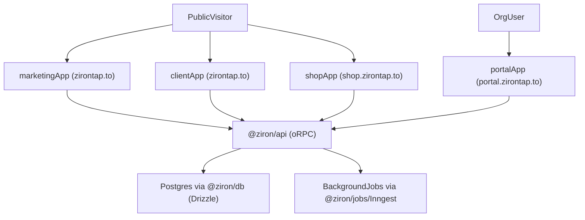

# ZironTap — Project Brief

> **Status:** Planning & research phase — this brief is the single source of truth for human developers, in-repo AI agents, and third‑party AI tools. It describes the intended product, architecture, and constraints for ZironTap.

---

## 1. Executive summary

**ZironTap** is a SaaS platform for shareable, trackable digital presence with multi‑channel access and enterprise‑ready features:

- **Digital business cards** — rich, branded profiles shareable via **link, QR, and NFC tap**.
- **URL shortener** — branded short URLs with redirect logic and click + campaign analytics.
- **QR generator** — multi‑type QR codes (URL, vCard, WiFi, etc.) with theming and campaign tracking.
- **Review cards** — flows to collect, manage, and showcase customer reviews.
- **Lead capture & CRM integrations (planned)** — capture leads from cards and sync them into external CRMs.
- **Backup & restore (CSV) + analytics** — org‑scoped export/import, funnels, and reporting for cards, links, QR, reviews, and leads.

The system is built as a **Turborepo monorepo** with four Next.js 16 apps and a strong multi‑tenant, org‑scoped architecture:

- `**marketing`** — marketing site and pricing.
- `**client`** — public, unauthenticated experiences (cards, redirects, reviews).
- `**portal**` — authenticated org admin portal.
- `**shop**` — public ecommerce shop for NFC cards, tags, and related products.

Domains and surfaces:

- `**zirontap.to**`  
  - Hosts the **marketing** and **client** experiences.  
  - Example public routes:
    - `zirontap.to/` — marketing landing (from `apps/marketing`).
    - `zirontap.to/pricing`, `zirontap.to/features` — marketing pages.
    - `zirontap.to/[slug]` — public digital card for a person/brand.
    - `zirontap.to/r/[shortCode]` — short‑link redirect.
    - `zirontap.to/review/[orgSlug]` — public review collection/display for an organization.
- `**shop.zirontap.to`**  
  - Hosts the **shop** app, a public ecommerce experience for NFC products (cards, tags, bundles, accessories).
  - Example public routes:
    - `shop.zirontap.to/products`
    - `shop.zirontap.to/products/[slug]`
    - `shop.zirontap.to/cart`
    - `shop.zirontap.to/checkout`
- `**portal.zirontap.to`**  
  - Hosts the **portal** app, the authenticated admin interface.
  - Example routes:
    - `portal.zirontap.to/[orgSlug]/cards`
    - `portal.zirontap.to/[orgSlug]/links`
    - `portal.zirontap.to/[orgSlug]/qr`
    - `portal.zirontap.to/[orgSlug]/reviews`
    - `portal.zirontap.to/[orgSlug]/media`
    - `portal.zirontap.to/[orgSlug]/billing`

ZironTap is designed as a **multi‑tenant, org‑scoped** system with strong validation and opinionated architecture so that AI agents can generate changes safely and consistently.

---

## 2. Product vision & goals

### 2.1 Problem and target users

Modern professionals and small businesses need:

- A **single shareable identity link** (digital card) that feels branded.
- **Trackable links** instead of raw URLs in bios, email signatures, and QR flyers.
- Easy ways to **collect social proof** (reviews) and show it credibly.
- A way to manage this without deep technical knowledge.

Target users:

- Solo professionals, freelancers, creators.
- Small agencies and SMBs that manage multiple brands.
- Teams that want centralized management of cards, links, QRs, and reviews for their organization.

### 2.2 Vision

ZironTap aims to be the **central hub for an organization’s digital touchpoints**:

- One place to define **who you are** (cards), **where you send people** (links & QRs), and **what others say** (reviews).
- Tight integration between **marketing surfaces** (`zirontap.to`) and **operational/admin surfaces** (`portal.zirontap.to`).
- A structure that is **AI‑friendly**: typed validators, clear routing, strong conventions, and shared packages.

### 2.3 Goals

- **Unified platform:** Cards, links, QR codes, reviews, media, analytics, and billing under one org.
- **Clear multi‑tenant model:** Everything org‑scoped via `organizationId` and `[orgSlug]`.
- **High developer/AI ergonomics:** Single source of truth for validation, well‑structured monorepo, dependency rules.
- **Production‑ready foundation:** Next.js 16, Better Auth, Drizzle/Postgres, oRPC, background jobs.

### 2.4 Non‑goals / out of scope (initially)

- Full‑blown e‑commerce or storefront features.
- Building a generic CMS for arbitrary content models.
- Deep website builder / page designer: **visual marketing design is owned by the human user**, not AI agents.
- Native mobile apps (focus is web first, with mobile‑friendly UX).

---

## 3. Core feature overview

This section describes the main product areas and their high‑level flows. Detailed DB fields and edge cases live in the Drizzle schemas and future specs.

### 3.1 Digital business cards

**What:** Public card pages at `zirontap.to/[slug]` that present a person or brand with:

- Name, title/role, organization.
- Avatar/cover image.
- Contact methods (email, phone, social links, website).
- Optional sections (about, links, featured content).
- Multiple access modes: direct link, QR code, and NFC tap.

**Primary flows:**

- Org admin/member creates a card in the portal under an organization.
- The card is mapped to a **unique slug** (`[slug]`) on `zirontap.to`.
- From the card detail view in the portal (`portal.zirontap.to/[orgSlug]/cards/[cardId]`), admins can place an order for NFC cards/tags linked to that digital card. This pre-fills an ecommerce order in the shop with the correct product and card context.
- Visitors access the card via direct URL, by scanning a QR code, or by tapping an NFC tag linked to the card.
- Views and relevant events can be tracked via analytics.

**NFC tag writing in portal:**

- The portal provides a workflow to associate a digital card URL with a physical NFC tag (using supported NFC writer hardware).
- This allows cards to be shared in three ways: **link access**, **QR code scan**, and **NFC tap**.

**Key entities / relationships:**

- `Organization` has many `Cards`.
- `Card` belongs to an `Organization` and is optionally associated with a `User` (e.g. staff profile).
- `Card` can reference `MediaAsset` records for avatar/cover, and related `Link` records for CTAs.

### 3.2 URL shortener

**What:** Short URLs under `zirontap.to/r/[shortCode]` that redirect to a long destination URL.

**Primary flows:**

- Org admin/member creates a short link in the portal with:
  - Destination URL
  - Optional UTM or tagging metadata
  - Optional association with a card or campaign
- System generates a unique `shortCode` per org (to avoid global collisions, or enforce per‑org uniqueness).
- Visitors hitting `zirontap.to/r/[shortCode]` are redirected to the destination, and a **click event** is recorded.

**Key entities / relationships:**

- `Organization` has many `Links` (short links).
- `Link` has `shortCode`, `destinationUrl`, and metadata.
- `ClickEvent` or analytics records are associated per `Link`.

### 3.3 QR generator

**What:** QR codes that can encode:

- URLs (card URLs, short links, arbitrary URLs),
- vCard contact info,
- WiFi credentials,
- Other future modes as needed.

**Primary flows:**

- In the portal, org admin/member creates a new QR or attaches one to:
  - A card (`zirontap.to/[slug]`),
  - A short link (`zirontap.to/r/[shortCode]`),
  - Another URL or payload.
- System generates and stores QR image (via `@ziron/qr` and `@ziron/media`), with optional branding (colors, logo).
- QR scans are attributed back to the underlying resource for analytics.

**Key entities / relationships:**

- `Organization` has many `QrCodes`.
- `QrCode` references a target (card, link, or generic URL) and a generated image in `MediaAsset`.

### 3.4 Review cards

**What:** Review collection and display flows, typically via:

- Collection URLs at `zirontap.to/review/[orgSlug]`.
- Embedded widgets and/or sections on cards to show curated reviews.

**Primary flows:**

- Org admin/member configures review settings (branding, categories, prompts) in the portal.
- System exposes a public review intake page at `zirontap.to/review/[orgSlug]`.
- Customers submit reviews; system stores them, optionally with ratings, tags, and moderation status.
- Admins moderate and selectively publish reviews to:
  - A public review listing, or
  - Card pages and marketing surfaces.

**Key entities / relationships:**

- `Organization` has many `Reviews`.
- `Review` may link to a particular card, product, or campaign.
- Review visibility is controlled per org (draft/published/hidden).

#### 3.4.1 External display via API keys

In addition to public collection and internal moderation, organizations can **display curated reviews on their own websites** via a read-only API powered by Better Auth API keys:

- Org admins generate **API keys** in the portal (scoped per organization) specifically for **public review display**.
- These keys are issued and stored by **Better Auth**, with scopes like `reviews:read_public` and metadata such as label and last-used timestamps.
- The customer’s backend calls a **JSON endpoint** on ZironTap, e.g.:
  - `GET https://zirontap.to/api/public/reviews`
  - Authenticated via `Authorization: Bearer <api_key>`
- The endpoint:
  - Validates the API key via Better Auth and resolves the associated `organizationId`.
  - Enforces the `reviews:read_public` scope and checks that the key is active.
  - Returns only **published reviews** for that organization in a sanitized format (rating, text, display name, publishedAt, etc.).
  - Supports pagination and is designed to be cache-friendly for server-side rendering and ISR.
- Customers are encouraged to:
  - Call this API from their **own backend**, not directly from the browser.
  - Render reviews using their own components and styling.
  - Rotate and revoke keys from the portal as needed.

### 3.5 Media management

**What:** Shared media library for:

- Profile avatars, cover images.
- Logos and branding assets for QR codes.
- Other visual assets used across cards and marketing.

**Primary flows:**

- Users upload images in the portal under `[orgSlug]/media`.
- `@ziron/media` handles conversion, compression, WebP, and thumbnail generation.
- Assets are referenced by cards, QR codes, and other entities.

### 3.6 Analytics

**What:** Tracking key events:

- Card views.
- Short‑link clicks.
- QR scans.
- Review submissions and conversions.
- Lead creation and downstream CRM sync status (when integrations are enabled).
- Ecommerce events (product views, add‑to‑cart, checkout started/completed, orders created).

**Primary flows:**

- Frontend surfaces (client & marketing apps) call `@ziron/analytics` helpers to record events.
- Events are persisted via API and can be surfaced in the portal (per org, per card/link/QR).
- Longer‑term, analytics may be offloaded / aggregated into a dedicated store (e.g. ClickHouse) as the product evolves.

**Smart link & QR campaign tracking (example):**

- Companies can treat short links and QR codes as **campaigns** and view aggregated performance.
- Example: a company prints 1,000 flyers, each with a QR code pointing to `zirontap.to/r/flyer2026`.  
  - Scans: 1,245  
  - Visitors: 980  
  - Leads: 73  
  - Conversion rate: 7.4%
- The portal’s analytics surfaces these metrics per campaign, card, and link.

**Funnels and reporting (planned):**

- Analytics will support viewing funnels such as:
  - Card views → lead submissions → CRM opportunities.
  - QR scans → site visits → signups or other key actions.
- Dashboards in the portal will provide:
  - Time‑series charts.
  - Breakdown by channel/campaign (e.g. specific short codes, QR campaigns, NFC entry points).
  - Export options (CSV) for deeper offline analysis.

Ecommerce analytics will extend these concepts to:

- Product views → add‑to‑cart → checkout started → order completed funnels.
- Revenue and AOV (average order value) for NFC products, visible in shop and portal views.

### 3.7 Billing & subscriptions

**What:** Integration with Polar for:

- One‑time purchases and/or plans.
- Mapping entitlements (e.g. number of cards/links, advanced analytics) to organizations.

**Primary flows:**

- Marketing site channels customers into Polar checkout from `/pricing` or other CTAs.
- Billing state is synced to `Organization` records via `@ziron/auth`/jobs.
- Portal enforces feature gates based on org’s plan / entitlements.

### 3.8 Lead capture from digital cards

**What:** Contact/lead capture flows directly from public card pages.

**Primary flows:**

- A visitor opens a card at `zirontap.to/[slug]`.
- The card can expose a lightweight contact form (e.g. name, email, phone, company, notes).
- When the visitor submits the form, the system creates a **Lead** associated with:
  - The organization.
  - The specific card (and optionally the underlying campaign or short link/QR that brought them there).
- Portal users can view, filter, and export leads for follow‑up.

**Key entities / relationships:**

- `Organization` has many `Leads`.
- `Lead` is linked to a `Card` and optionally to a `Link`/`QrCode` campaign.
- Lead creation is tracked in analytics and contributes to conversion‑rate metrics.

### 3.9 Card templates, branding & visual editor

**What:** A system of reusable card templates and branding controls, managed through a visual editor in the portal.

**Primary flows:**

- Org admin defines brand settings (colors, typography tokens, logos) and chooses from a library of templates.
- Within the portal, a **card template editor** allows configuring:
  - Layout (section order, visibility of elements like bio, links, reviews).
  - Branding (using tokens rather than arbitrary CSS).
  - Component‑level options (button styles, card shapes, etc.) within the constraints of the design system.
- Cards reference a template configuration so that:
  - Global branding tweaks can apply across many cards.
  - AI agents can create/edit cards without redefining layout rules.

**Key entities / relationships:**

- `Template` / `Theme` definitions live in `@ziron/templates` and are persisted in the DB where necessary.
- `Card` references a template identifier and brand configuration.
- The visual editor in the portal writes structured configuration, not arbitrary HTML/CSS.

### 3.10 Backup & restore (CSV)

**What:** Org‑scoped backup and restore flows using CSV export/import to make data portable and recoverable.

**Primary flows:**

- **Backup/export:**
  - Portal users with appropriate roles (e.g. Super admin/Admin) can export org data (cards, links, QR codes, reviews, leads, etc.) as CSV files per entity type.
  - Exports are always filtered by `organizationId` and never mix data from multiple orgs.
  - Exports include stable identifiers where safe (e.g. slugs, short codes) so that later imports can reconcile entities.
- **Restore/import:**
  - Admins can import CSVs back into the system for:
    - Restoring a prior snapshot for an org.
    - Bulk creation or updates (e.g. uploading a large set of links or cards).
  - Imports run through `@ziron/validators` and safety checks:
    - Strict validation of columns and types.
    - Dry‑run mode that reports what would change before committing.
    - Clear conflict handling rules (e.g. what happens when slugs/short codes already exist).
- **Scheduled/system backups (implementation detail):**
  - Separate from user‑initiated CSV flows, the platform maintains regular database backups for disaster recovery.

**Key entities / relationships:**

- Backups are always scoped to a single `Organization`.
- Import operations are logged with actor, timestamp, and summary of changes for auditing.

### 3.11 CRM integrations (planned)

**What:** First‑class integrations with CRMs so that leads and engagement data can sync into existing sales workflows.

**Primary flows (conceptual):**

- When a **Lead** is created from a card/QR/link funnel, the system can:
  - Push the lead into a connected CRM (e.g. as a contact/lead record).
  - Attach campaign/source metadata derived from links/QR codes (UTM, shortCode, card slug).
- Periodic sync jobs can:
  - Pull updated status fields from the CRM (e.g. lead stage, opportunity status) back into ZironTap.
  - Update analytics dashboards to reflect downstream pipeline performance.
- Org admins configure integrations in the portal (e.g. connect CRM, map fields, enable specific syncs).

**Key entities / relationships:**

- `Lead` becomes the core bridge between ZironTap and external CRMs.
- Integration configuration (provider, org credentials, field mappings) is stored per `Organization` and used by jobs to sync data.

### 3.12 NFC product shop (`shop.zirontap.to`)

**What:** A public ecommerce shop for NFC‑related products operated by ZironTap, exposed at `shop.zirontap.to` and backed by a dedicated `apps/shop` app.

**Products (examples):**

- NFC business cards (single and packs).
- NFC tags and stickers.
- Bundles (e.g. starter kits with multiple cards/tags).
- Accessories (e.g. card holders, display stands) as needed.

**Primary customer journey:**

- Visitor lands on `shop.zirontap.to/products` or a specific product URL.
- Browses the catalog, filters or searches products, and opens product detail pages.
- Adds one or more products (with variants/quantities) to a cart.
- Proceeds to checkout, where the shop:
  - Collects shipping/contact details.
  - Hands off to, or embeds, **Polar** for payment.
- After successful payment, ZironTap:
  - Records an `Order` with `OrderItem` line items.
  - Triggers fulfillment workflows (e.g. preparing and shipping NFC cards/tags).
  - Surfaces order status for internal operators and, where appropriate, customers.

Orders can originate either from public visitors on `shop.zirontap.to` or from authenticated org users in the portal when they order NFC products for a specific digital card. Portal-initiated orders pre-attach the related `Card` so fulfillment knows which profile the NFC product represents.

**Relationship to the rest of the platform:**

- The shop is focused on **ZironTap selling NFC products**, not a generic multi‑vendor marketplace.
- Orders can be linked back to:
  - Organizations (e.g. when existing customers buy NFC kits for their teams).
  - Marketing/analytics campaigns (e.g. which campaign led to the purchase).
  - Future CRM integrations for post‑purchase engagement.

---

## 4. Apps, domains & surfaces

### 4.1 Apps in the monorepo

- `**apps/marketing`**  
  - Next.js 16 App Router app.  
  - Primary routes: `/`, `/pricing`, `/features`, plus future marketing pages.  
  - Deployed under base domain `zirontap.to`.
- `**apps/client`**  
  - Next.js 16 App Router app for public, user‑facing experiences.  
  - Primary routes:
    - `/[slug]` — public card.
    - `/r/[shortCode]` — short‑link redirect.
    - `/review/[orgSlug]` — review collection & display.
  - Also deployed under base domain `zirontap.to` (behind the same public domain, with appropriate routing/rewrites).
- `**apps/portal**`  
  - Next.js 16 App Router app for authenticated org admin/member flows.  
  - Primary route patterns (admin portal):
    - `/[orgSlug]/cards`
    - `/[orgSlug]/links`
    - `/[orgSlug]/qr`
    - `/[orgSlug]/reviews`
    - `/[orgSlug]/media`
    - `/[orgSlug]/billing`
  - Exposed as `portal.zirontap.to`.
  - Includes tools to generate QR codes and write NFC tags for cards/links (where compatible NFC writer hardware is available).
- `**apps/shop**`  
  - Next.js 16 App Router app for NFC ecommerce.  
  - Primary routes: `/products`, `/products/[slug]`, `/cart`, `/checkout`.  
  - Deployed under `shop.zirontap.to`.

### 4.2 Public vs. authenticated surfaces

- **Public (anonymous) surfaces — `zirontap.to` and `shop.zirontap.to`**
  - Marketing pages (landing, pricing, features) on `zirontap.to`.
  - Public card pages (`/[slug]`) on `zirontap.to`.
  - Redirects (`/r/[shortCode]`) on `zirontap.to`.
  - Review collection pages (`/review/[orgSlug]`) on `zirontap.to`.
  - Shop catalog and product detail pages (`/products`, `/products/[slug]`) on `shop.zirontap.to`.
  - Cart and checkout flows (`/cart`, `/checkout`) on `shop.zirontap.to`.
  - These routes do not require login; they may still read from the API/DB to render server components and track analytics.
- **Authenticated portal surfaces — `portal.zirontap.to`**
  - All routes are scoped by `[orgSlug]` and require an authenticated user.
  - Role‑based access (Super admin, Admin, Member) controls what actions are allowed per route.
  - Includes internal/admin views for managing NFC products and orders (e.g. `/[orgSlug]/shop`, `/[orgSlug]/shop/orders`) for ZironTap operators or a designated internal org.

### 4.3 High‑level flow diagram

---

## 5. Architecture overview

### 5.1 Monorepo and tooling

- **Monorepo:** Turborepo with **pnpm workspaces**.
- **Apps:** `marketing`, `client`, `portal`.
- **Shared packages:**  
  - `@ziron/auth` — Better Auth integration, orgs, Polar plugin, API keys plugin.  
  - `@ziron/api` — oRPC routers, API context, rate‑limit integration.  
  - `@ziron/db` — Drizzle ORM schema and migrations.  
  - `@ziron/validators` — Zod schemas for validation (single source of truth).  
  - `@ziron/ui` — shared UI components (shadcn + Base UI), form components, image editor.  
  - `@ziron/media` — image processing/compression/WebP/thumbnails.  
  - `@ziron/qr` — QR code encoding and rendering.  
  - `@ziron/analytics` — event tracking helpers.  
  - `@ziron/templates` — theme/template logic.  
  - `@ziron/email` — email sending (`nodemailer` + `react-email`).  
  - `@ziron/jobs` — background job abstractions (Inngest).  
  - `@ziron/sync` — offline‑first utilities (IndexedDB, queues).  
  - `@ziron/config` — environment validation via `t3-oss/env-nextjs`.  
  - `@ziron/rate-limit` — rate limiter utilities.

### 5.2 Tech stack (summary)

- **Runtime / framework:** Next.js 16 (App Router) for all apps.
- **Language:** TypeScript across apps and packages.
- **Auth:** Better Auth with organizations, Google/Apple/passkeys, Polar, API key.
- **Data access:** Drizzle ORM targeting Postgres.
- **API:** oRPC with strongly typed routers; no public REST surface by default.
- **Jobs:** Inngest (swappable) for background tasks.
- **UI:** shadcn + Base UI, TanStack Form, Jotai, nuqs, custom components in `@ziron/ui`.
- **Lint/format:** Biome (no ESLint, no Prettier).

### 5.3 Deployment assumptions (high level)

- `zirontap.to, shop.zirontap.to` and `portal.zirontap.to` are deployed as separate Next.js apps with shared backend primitives.
- API/routes are primarily defined within app routes and `@ziron/api` oRPC endpoints.
- Background jobs and webhooks run as serverless functions or long‑running workers, using Inngest and Postgres.

---

## 6. Data model & domain entities

This is a conceptual overview; the canonical implementation lives in `packages/db/src/schema/`.

### 6.1 Core entities

- **Organization**
  - Represents a customer account (company, team, brand).
  - Identified by `id` and human‑friendly `[orgSlug]`.
  - Owns all cards, links, QR codes, reviews, and media.
- **User**
  - Authenticated identity via Better Auth.
  - Can belong to one or more organizations with roles.
- **Membership / Role**
  - Links `User` to `Organization`.
  - Encodes role: `Super admin > Admin > Member`.
  - Drives authorization checks throughout the portal.
- **Card**
  - Digital business card entity.
  - Contains identity fields (name, title), structured content, references to media.
  - Mapped to a card slug (`[slug]`) under `zirontap.to/[slug]`.
- **Link**
  - Short link record for `/r/[shortCode]`.
  - Stores destination URL, metadata, and possibly association to a card or campaign.
- **QrCode**
  - Represents a generated QR code and its configuration.
  - References a target (card, link, or raw URL) and associated `MediaAsset`.
- **Review**
  - Customer review record scoped to an organization.
  - May include rating, text, metadata, and moderation status.
  - Accessed or collected via `zirontap.to/review/[orgSlug]` or via embedded widgets.
- **MediaAsset**
  - Uploaded / generated images and other assets.
  - Stores URLs, dimensions, type, usage context, and ownership (org).
- **Template / Theme (future‑facing)**
  - Defines themes/templates for cards and public views.
  - Stored in `@ziron/templates`, with schema in DB where needed.
- **Lead**
  - Represents a captured contact generated from a card, short link, QR campaign, or related funnel.
  - Stores contact details, source (card/link/QR), campaign metadata, and timestamps.
  - Used for follow‑up workflows and conversion analytics.
- **Product**
  - Represents a sellable NFC product (card, tag, bundle, accessory) in the shop catalog.
  - Stores title, description, media, pricing, and variant information (e.g. quantities, finishes).
  - Primarily owned and managed by ZironTap (not customer orgs) via internal/admin portal views.
- **Order**
  - Represents a customer purchase of one or more products from `shop.zirontap.to`.
  - Stores customer contact/shipping details, payment status, totals, and linkage to Polar payment sessions.
  - Drives fulfillment workflows and post‑purchase analytics.
  - May optionally reference a `Card` (e.g. `cardId`) when the order is placed from the portal for a specific digital card, enabling card-aware fulfillment and analytics.
- **OrderItem**
  - Line item within an `Order`, referencing a specific `Product`, quantity, and price.
  - Used to compute order totals and product‑level sales metrics.

### 6.2 Org scoping

- Every domain entity that can contain user data (card, link, QR, review, media, analytics) is **org‑scoped**:
  - Must have `organizationId`.
  - All queries are filtered by current org context derived from auth/session.
- Routes in the portal always include `[orgSlug]` to reinforce this scoping at the URL level.

---

## 7. API & backend patterns

### 7.1 oRPC and `@ziron/api`

- API is defined via **oRPC routers** in `@ziron/api` (e.g. `packages/api/src/router.ts` and sub‑routers).
- Each router:
  - Accepts typed input validated via `@ziron/validators`.
  - Runs with a typed context that includes auth, org, rate limiting, and logging helpers.
  - Returns typed responses used directly by frontend clients (no manual DTOs).

### 7.2 Validation via `@ziron/validators`

- All input validation is centralized:
  - Every route, form, and job uses schemas from `@ziron/validators`.
  - **No duplication** of validation logic in components or routes.
- AI agents must:
  - Prefer existing schemas instead of creating new ones.
  - If a new schema is needed, define it in `@ziron/validators` and reuse it across the stack.

### 7.3 Auth and org context

- Better Auth handles:
  - Authentication (email/password, OAuth, passkeys, etc. as configured).
  - Organization membership and roles.
  - Polar integration for billing entitlements.
  - **API keys** for server-to-server access, including **per-organization review display keys** scoped with permissions like `reviews:read_public`.
- Request context includes:
  - Current user (if authenticated).
  - Current organization (derived from `orgSlug` and membership).
  - Role information to enforce permissions per action.

### 7.4 Background jobs and async work

- `@ziron/jobs` plus Inngest used for:
  - Heavy media processing (large images, QR generation).
  - Analytics aggregation and cleanup.
  - Webhook handling (e.g. billing events).
- Jobs are triggered from oRPC handlers or app routes and run with the same org‑scoped principles.

### 7.5 Rate limiting & safety

- `@ziron/rate-limit` provides shared rate‑limiting utilities applied at:
  - Public endpoints that can be spammed (review submission, link creation, auth flows).
  - Sensitive admin operations, if needed.
- AI agents should assume **rate limiting is required** for:
  - Any endpoint exposed publicly.
  - Any looped or bulk operation that may be called from the client.

### 7.6 Shop orders & Polar payments (planned)

- The shop app (`apps/shop`) uses the same oRPC and validation patterns:
  - Product/catalog queries and cart operations go through `@ziron/api` routers with `@ziron/validators` schemas.
  - Checkout initiation calls a backend route that:
    - Validates the cart.
    - Creates a Polar payment session for the order amount.
    - Redirects or embeds Polar checkout for payment.
- After payment, Polar webhooks and/or callback routes:
  - Verify the payment result.
  - Create or update an `Order` and associated `OrderItem` records.
  - Trigger fulfillment jobs (e.g. printing and shipping NFC cards) via `@ziron/jobs`/Inngest.
- Portal-initiated orders: from a card detail route in `apps/portal`, a backend handler builds a cart for the appropriate NFC product, starts a Polar checkout session, and on success creates an `Order` linked to both the `Organization` and the originating `Card`.
- Ecommerce events (product view, add‑to‑cart, checkout started/completed) are emitted through `@ziron/analytics` and can feed into CRM integrations.

---

## 8. Frontend & UX principles

### 8.1 Ownership of visual design

- **Human designers/owners** control:
  - Page layouts.
  - Visual styling, theming, and marketing copy.
- **AI agents must not:**
  - Redesign marketing pages.
  - Introduce custom visual design systems beyond what `@ziron/ui` already provides.

### 8.2 What AI should do on the frontend

- Wire up:
  - Routes, loaders, and server components.
  - Data fetching via oRPC.
  - Form state with TanStack Form + Zod schemas from `@ziron/validators`.
  - Client state with Jotai where appropriate.
  - URL/search param state with `nuqs`.
- Implement:
  - Input validation and error handling consistent with schemas.
  - Loading and error UI that fit existing patterns.
  - Integration points with `@ziron/analytics` for event tracking.

### 8.3 UI stack usage

- Use shared components from:
  - `@ziron/ui` for forms, inputs, buttons, modals, sheets, etc.
  - shadcn/Base UI as wrapped by `@ziron/ui`, not raw copies.
- Avoid:
  - Creating ad‑hoc UI components per app when a shared one is appropriate.
  - Introducing new design systems or libraries without updating the architecture docs.

---

## 9. Cross‑cutting concerns

### 9.1 Security

- **Authentication & authorization**
  - All portal routes require auth; no direct access to other orgs.
  - Access is role‑based (Super admin, Admin, Member).
  - API handlers must always derive org context from session + `[orgSlug]`, not from untrusted request data alone.
- **Multi‑tenancy**
  - Every query must be filtered by `organizationId`.
  - No cross‑org joins or leaks in logs, errors, or analytics exports.
- **Input handling**
  - Always validate with `@ziron/validators` before touching DB or external services.
  - Sanitize HTML/Markdown for user‑generated content where relevant (e.g. review text).
- **Enterprise posture (planned enhancements)**
  - Stronger authentication options (e.g. SSO/SAML) for larger organizations.
  - Audit logs for key actions (login, membership changes, card/link/QR/review changes, imports/exports, billing events).
  - Clear backup & restore guarantees:
    - Regular system‑level backups.
    - Org‑scoped CSV export/import with validation and dry‑run flows (see backup & restore section).
  - Data protection practices (encryption at rest/in transit, secrets management) aligned with modern SaaS expectations.
  - **API keys for external review display**
  - Review display API keys are issued and stored by Better Auth and are treated as **secrets**, intended for backend/server-side use only.
  - Each key is tied to a single `organizationId` and limited to read-only scopes (e.g. `reviews:read_public`).
  - Public endpoints that accept these keys are **rate-limited** and always filter data by the resolved `organizationId` and `published` status of reviews.
  - Keys can be rotated and revoked from the portal; revoked keys immediately lose access.

### 9.2 Performance

- Use Next.js 16 best practices:
  - Prefer server components for data‑heavy pages.
  - Avoid unnecessary client components and large client‑side bundles.
- Analytics writes:
  - Should be lightweight and ideally batched or handled via background jobs when volume grows.
  - Must not block core user flows (e.g. card view should be quick even if analytics is slow).

### 9.3 Observability

- Logging:
  - Log significant events (auth, org membership changes, billing events, job failures) with org and user context.
- Metrics:
  - Track key health indicators (API latency, error rates, job retry counts).
- Error handling:
  - Use structured error types where possible so that UIs can respond gracefully.

---

## 10. Constraints & conventions for AI agents

### 10.1 Coding conventions

- **Commits:**  
  - Format: `type(scope): description`, all lowercase.  
  - Types: `feat`, `fix`, `docs`, `style`, `refactor`, `test`, `chore`, `perf`, `ci`, `revert`.
  - No body or footer; single‑line messages only.
- **TypeScript style:**  
  - Prefer `interface` over `type` for object shapes.  
  - Avoid `enum`; use `const` objects + union types.
- **Lint/format:**  
  - Use **Biome only**.  
  - Do not add ESLint or Prettier configs.

### 10.2 Dependency rules

- Packages must **not** depend on apps.
- `@ziron/ui` must **not** depend on `@ziron/api`.
- Enforced via dependency‑cruiser and `@ziron/dependency-rules`.
- When adding new imports:
  - Prefer importing from local packages (e.g. `@ziron/ui`, `@ziron/api`) instead of deep relative paths in apps.

### 10.3 Validation and schemas

- Always reuse validators from `@ziron/validators` for:
  - API inputs and outputs where appropriate.
  - Form schemas in the portal and client apps.
- If a schema is missing:
  - Add it to `@ziron/validators`.
  - Wire it into both the backend (oRPC) and frontend (forms) to keep them in sync.

### 10.4 Do / don’t for AI agents

- **Do:**
  - Implement routes and handlers according to this brief.
  - Wire forms to oRPC endpoints with proper validation and error handling.
  - Respect org scoping and roles in every operation.
  - Add tests where appropriate (unit, integration, E2E) following project conventions.
- **Don’t:**
  - Redesign the marketing website or substantially change visual layouts.
  - Introduce new global dependencies or patterns without aligning with this architecture.
  - Bypass `@ziron/validators` or manually duplicate validation logic.

---

## 11. Roadmap & phases (draft)

This is a draft roadmap for planning and may evolve.

### Phase 0 — Foundations (current)

- Set up Turborepo, pnpm workspaces, and base apps (`marketing`, `client`, `portal`).
- Implement Better Auth with organizations and roles.
- Establish `@ziron/db`, `@ziron/validators`, `@ziron/api`, `@ziron/ui`, and dependency rules.
- Configure basic deployment/development workflows and environment validation via `@ziron/config`.

### Phase 1 — MVP

- Digital cards:
  - Basic card model, creation, and editing in portal.
  - Public card pages at `zirontap.to/[slug]`.
- Short links:
  - Create/manage links in portal.
  - Redirects at `zirontap.to/r/[shortCode]`.
- QR codes:
  - Generate QR codes pointing to cards and links.
- Reviews:
  - Basic review collection at `zirontap.to/review/[orgSlug]`.
- Media:
  - Simple media upload and usage for avatars/covers.
- Core analytics:
  - Record views/clicks for cards and links.

### Phase 2 — Beta

- Improve card templates and configurations (layouts, sections, CTAs).
- Enhanced review flows (moderation, approvals, featured reviews).
- Deeper analytics dashboards in portal.
- Expanded QR code modes and theming.
- Billing integration hardening with Polar (plan enforcement, upgrade paths).
- Launch `shop.zirontap.to` (`apps/shop`) full‑store MVP for NFC products (catalog, cart, Polar checkout, order tracking).

### Phase 3 — v1 and beyond

- Advanced analytics (cohorts, funnels, richer attribution; potential integration with analytical stores).
- Better automation around review collection and follow‑ups.
- Expanded templates and theming system via `@ziron/templates`.
- Additional integrations (calendar, CRM, email tools) as needed.

---

## 12. References & further reading

- **AI overview & quick context:**  
  - `AGENTS.md` — high‑level overview for AI assistants working in the repo.
- **Database schemas:**  
  - `packages/db/src/schema/` — Drizzle ORM schemas for all core entities.
- **API & validation:**  
  - `packages/api/src/router.ts` and related files — oRPC routers.  
  - `packages/validators` — Zod validators used across backend and frontend.
- **UI components & forms:**  
  - `packages/ui` — shared UI building blocks and form components.
- **Jobs & background processing:**  
  - `packages/jobs` — job definitions and helpers for Inngest.

This brief should be treated as the **canonical high‑level spec** that all agents and contributors follow. When in doubt, align with this document first, then refine with deeper package‑level docs and code. 